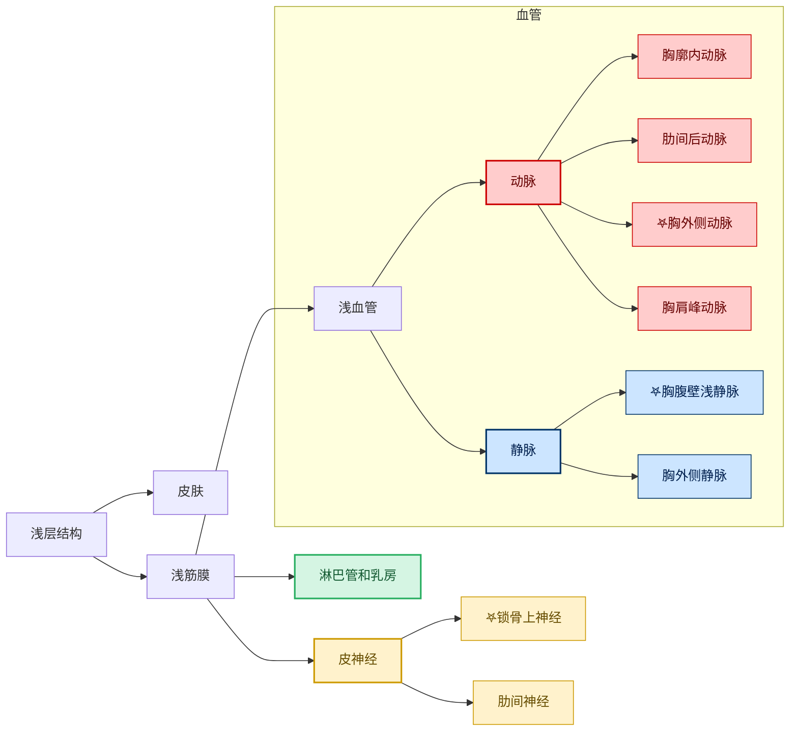
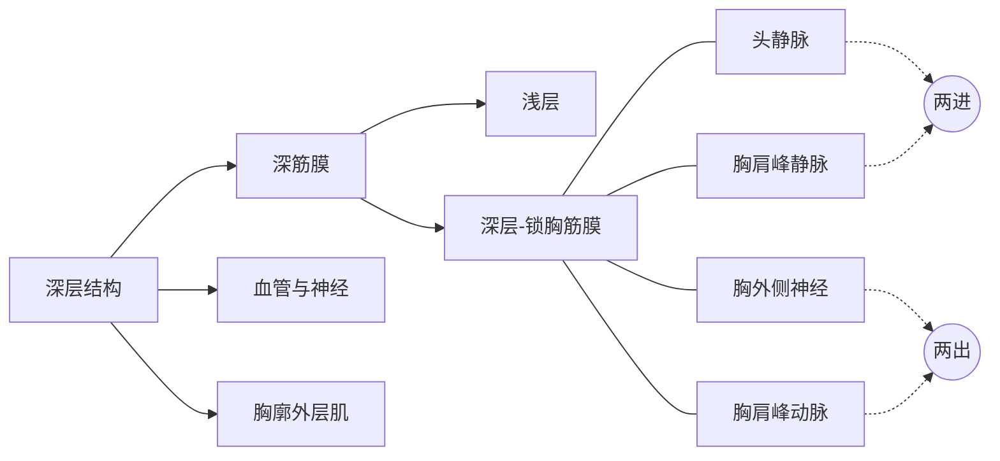
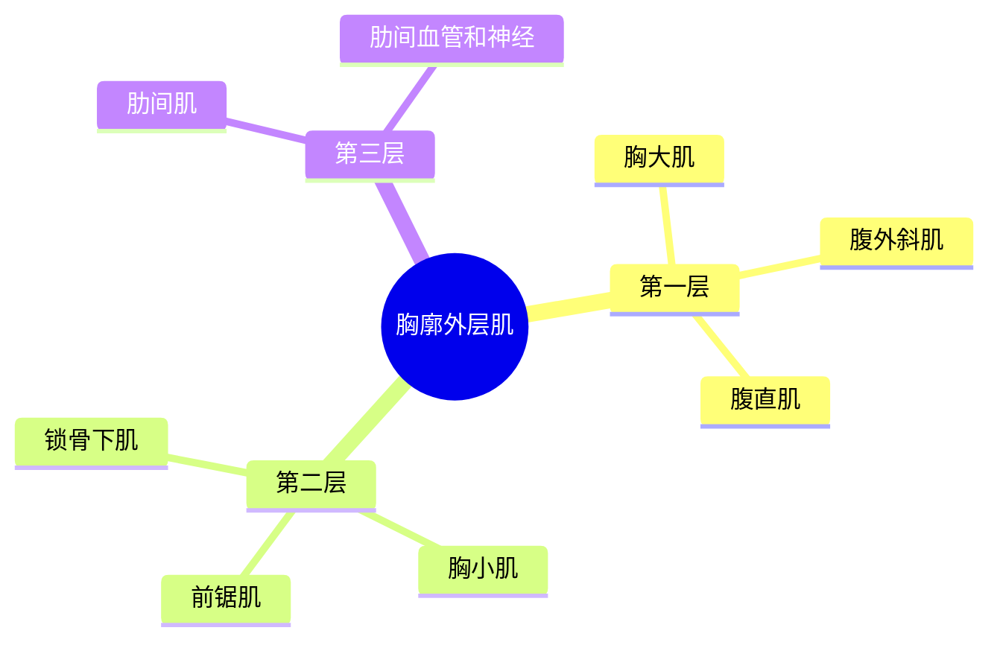
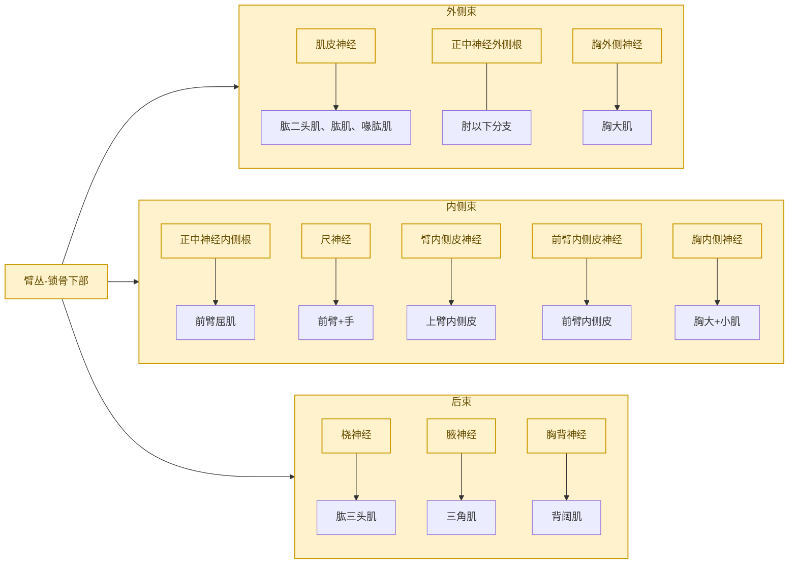
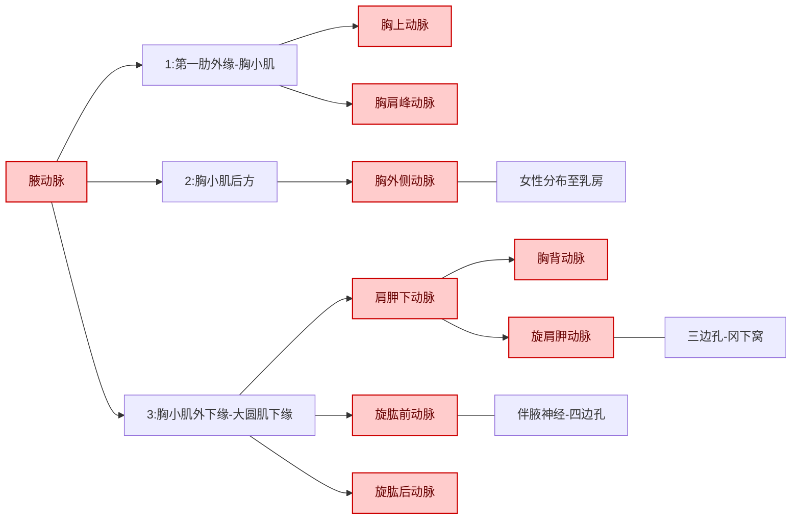
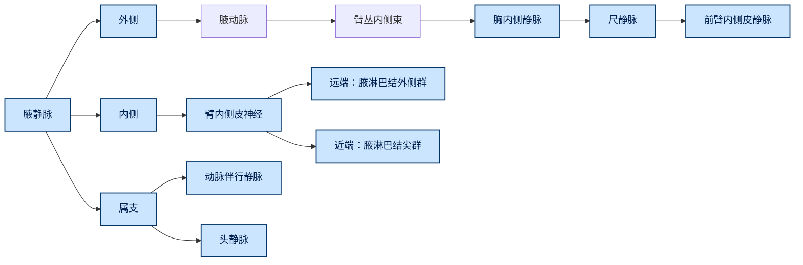

> [!NOTE] 学习目标
> 1. 辨别胸部体表标志、**标志线**
> 2. 乳房位置、构造及**淋巴回流**
> 3. 结构的安排及血管、神经走行特点，胸神经前支的节段性分布
> 4. **锁胸筋膜**的位置及通过的结构
> 5. 上肢的表面解剖
> 6. 腋窝的主要内容、腋动脉各段的分支
> 7. 臂丛各束的主要分支
> 8. 锁骨上淋巴结、腋淋巴结分群、各群收纳及淋巴回流

# 概述
1. 胸部境界与分区
2. 体表标志
3. 胸部标志线
4. 胸部外形
5. 胸壁
# 胸前外侧区
## 浅层
##### 1. 皮肤
##### 2. 浅筋膜
###### 1. 浅血管
1. 动脉
	1. 胸廓内动脉
	2. 肋间后动脉穿支
	3. 胸肩峰动脉分支
2. 静脉
	1. 胸腹壁浅静脉
	2. 胸外侧静脉
###### 2. 皮神经
1. 锁骨上神经
2. 肋间神经外侧皮支和前皮支
###### 3. 淋巴管
### 乳房
1. 位置
2. 形态结构
3. 血管和神经分布
	1. 动脉：
		1. 胸外侧动脉
		2. 胸廓内动脉
	2. 静脉：
		1. 浅：胸腹壁静脉 - 胸外侧静脉 - 腋静脉
		2. 深：胸廓内静脉、肋间后静脉和腋静脉
4. 淋巴结及回流

|         |             |
| ------- | ----------- |
| 外侧部+中央部 | 胸肌淋巴结（主要）   |
| 上部      | 尖淋巴结和锁骨上淋巴结 |
| 内侧部     | 胸骨旁淋巴结      |
| 深部      | 胸肌间淋巴结、尖淋巴结 |
| 内下部     |             |

## 深层
##### 1. 深筋膜
1. 浅层
2. 深层--**锁胸筋膜**
	- 位置
	- 穿行
##### 2. 胸廓外肌层

#### Summary




| 结构    | 位置                             | 意义                             |
| ----- | ------------------------------ | ------------------------------ |
| 锁骨上神经 | 颈丛分出，跨越锁骨前分布胸骨柄前、锁骨下窝处和肩部皮肤    |                                |
| 肋间神经  | 腋中线--分出外侧皮支<br>胸骨两侧--分出前皮支、后皮支 | 节段性和带状分布                       |
| 胸外侧动脉 | 起自腋动脉--分布于前锯肌                  |                                |
| 胸腹壁静脉 | 起自脐周静脉网，汇入胸外侧静脉，注入腋静脉          | 上下腔静脉吻合通道之一；门静脉高压时可建立门-腔静脉侧支循环 |


---
## 深层结构





### 锁胸筋膜

- ==位置==：位于胸大肌深面，为胸部筋膜的深层，位于喙突、 锁骨下肌、胸小肌上缘之间包裹锁骨下肌和胸小肌
	- *胸大肌*深面 
	- 上端附于*锁骨* 
	- 下分两层包裹*锁骨下肌*和*胸小肌* 
	- 覆盖*前锯肌*表面
- ==穿行结构==：
	- 两进：**头静脉、胸肩峰静脉**
	- 两出：**胸肩峰动脉、胸外侧神经**（支配胸大肌）
### 胸肌

| 名称  | 起点  | 止点  | 主要作用       | 神经支配  |
| --- | --- | --- | ---------- | ----- |
| 胸大肌 |     |     | 内收、内旋、屈肩关节 | 胸外侧神经 |
| 胸小肌 |     |     | 拉肩胛骨向下     | 胸内侧神经 |
| 前锯肌 |     |     | 拉肩胛骨向前     | 胸长神经  |
|     |     |     |            |       |
[](01周%20概述%20胸前区、腋窝、股前内侧区%20%20浅深层.pdf#page=38&annotation=5546R|01周%20概述%20胸前区、腋窝、股前内侧区%20%20浅深层,%20页面%2038)

 


# 腋区


### （一）位置
### （二）构成
- 一顶、一底、四壁
- 后壁：三边孔、四边孔
	```mermaid
	graph LR
    A[腋窝]

    %% 墙面/边界
    A --> B[顶：锁骨+第一肋]
    A --> C[底：皮肤+腋窝筋膜]
    A --> D[前壁：胸大肌、胸小肌]
    A --> E[后壁：肩胛下肌、背阔肌、大圆肌]
    E --> E1[三边孔]
    E --> E2[四边孔]
    A --> F[内壁：前锯肌+肋骨]
    A --> G[外壁：肱骨外科颈]

    %% 样式
    classDef boundary fill:#f2f2f2,stroke:#999,stroke-width:1.5px;
    class A,B,C,D,E,E1,E2,F,G boundary;

	```
### （三）内容
#### 1. 臂丛（锁骨下部）及其分支
1. 外侧束
	1. 肌皮神经
	2. 正中神经外侧根
	3. 胸外侧神经
2. 内侧束
	4. 正中神经内侧根
	5. 尺神经
	6. 臂内侧皮神经
	7. 前臂内侧皮神经
	8. 胸内侧神经
3. 后束
	1. 桡神经
	2. 腋神经
	3. 胸背神经



#### 2. 腋动脉及其分支
1. 第一段：胸上动脉、胸肩峰动脉
2. 第二段：胸外侧动脉
3. 第三段：肩胛下动脉（胸背动脉、旋肩胛动脉）、旋肱前动脉、旋肱后动脉


#### 3. 腋静脉及其分支
1. 外侧：腋动脉-臂丛内侧束-胸内侧静脉-尺静脉-前臂内侧皮静脉
2. 内侧：臂内侧皮神经
	1. 远端：腋淋巴结外侧群
	2. 近端：腋淋巴结尖群
3. 属支：动脉伴行静脉，头静脉

#### 4. 腋淋巴结
1. **外侧淋巴结**
2. **胸肌淋巴结**
3. **肩胛下淋巴结**
4. **中央淋巴结**
5. **尖淋巴结**

#### 5. 腋鞘


