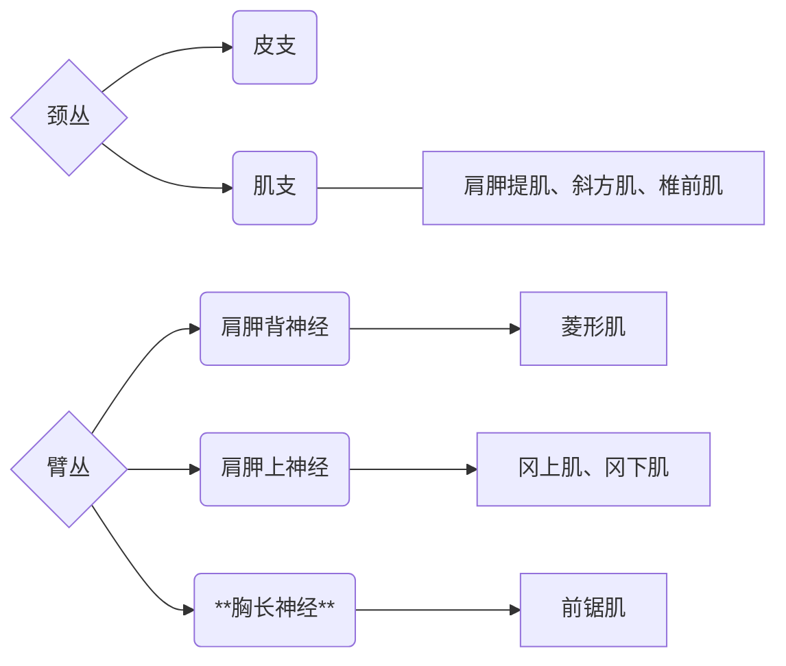

#### 枕三角
##### 1. 境界
##### 2. 内容
1. 副神经
	- 副神经根部损伤：患侧胸锁乳突肌和斜方肌 瘫痪，出现头不能向患侧侧屈，肩下垂， 提肩无力等临床表现
	- 副神经枕三角内受损：仅影响斜方肌；患侧肩下垂，提肩无力等临床表现
2. 颈丛、臂丛分支

#### 肩胛舌骨肌锁骨三角/锁骨上三角
##### 1. 境界
##### 2. 内容
1. 锁骨下静脉及静脉角
2. 锁骨下动脉
3. 臂丛


---
```dataviewjs
// =====================================================
// 链接关系仪表盘（稳定版） — 纯 DOM 渲染，避免 Dataview 元素类型问题
// =====================================================
const cur = dv.current();
const filePath = cur?.file?.path ?? null;

// === 辅助函数 ===
function extractPath(item){
    if(!item) return null;
    if(typeof item === "string") return item;
    if(item.path) return item.path;
    if(item.file && item.file.path) return item.file.path;
    return null;
}
function isValidNote(path){
    if(!path) return false;
    const lower = path.toLowerCase();
    return !lower.match(/\.(png|jpg|jpeg|gif|svg|webp|mp4|mov|zip|json|csv|xlsx|docx)$/);
}
function displayNameFor(path){
    const pg = dv.page(path);
    return pg?.file?.name ?? path.split('/').pop();
}

// === 获取出链（多重兼容） ===
let outRaw = [];
try {
    if(typeof dv.outgoing === "function" && filePath) outRaw = dv.outgoing(filePath);
    else if (cur?.outlinks) outRaw = cur.outlinks;
    else if (cur?.file?.outlinks) outRaw = cur.file.outlinks;
} catch(e) { outRaw = []; }
const outPaths = [...new Set((outRaw || []).map(extractPath).filter(isValidNote))];

// === 获取反链（优先 dv.incoming，否则全库扫描） ===
let inRaw = [];
try {
    if(typeof dv.incoming === "function" && filePath) inRaw = dv.incoming(filePath);
    else {
        inRaw = dv.pages().where(p => {
            try {
                const ol = p.file?.outlinks ?? p.outlinks ?? [];
                return ol.some(l => extractPath(l) === filePath);
            } catch(e){ return false; }
        }).array();
    }
} catch(e) { inRaw = []; }
const inPaths = [...new Set((inRaw || []).map(extractPath).filter(isValidNote))];

// === 使用纯 DOM 构建视图 ===
const container = document.createElement("div");
container.className = "link-dashboard";

// 卡片构造器（返回 DOM 节点）
function createCard(title, paths, emptyMsg, icon){
    const card = document.createElement("div");
    card.className = "link-card";

    const h3 = document.createElement("h3");
    h3.textContent = `${icon} ${title} (${paths.length})`;
    card.appendChild(h3);

    if(paths.length){
        // 排序
        paths.sort((a,b) => (displayNameFor(a) ?? a).localeCompare(displayNameFor(b) ?? b));
        const ol = document.createElement("ol");
        for(const p of paths){
            const li = document.createElement("li");

            const a = document.createElement("a");
            a.href = "#";
            a.textContent = displayNameFor(p);
            a.style.cursor = "pointer";

            // 点击通过 Obsidian API 打开链接（在新 leaf）
            a.addEventListener("click", (e) => {
                e.preventDefault();
                try {
                    app.workspace.openLinkText(p, "", true);
                } catch(err) {
                    // 回退尝试按显示名打开
                    try { app.workspace.openLinkText(a.textContent, "", true); } catch(e2){ console.error(e2); }
                }
            });

            li.appendChild(a);
            ol.appendChild(li);
        }
        card.appendChild(ol);
    } else {
        const p = document.createElement("p");
        p.textContent = emptyMsg;
        p.style.opacity = "0.75";
        card.appendChild(p);
    }

    return card;
}

// 插入卡片
container.appendChild(createCard("本文引用的笔记", outPaths, "📭 本文未引用其他笔记。", "📓"));
container.appendChild(createCard("引用了本文的笔记", inPaths, "📪 目前没有笔记引用本文。", "📑"));

// 将纯 DOM 容器挂到 Dataview 输出区域（稳健方式）
dv.container.appendChild(container);


```
