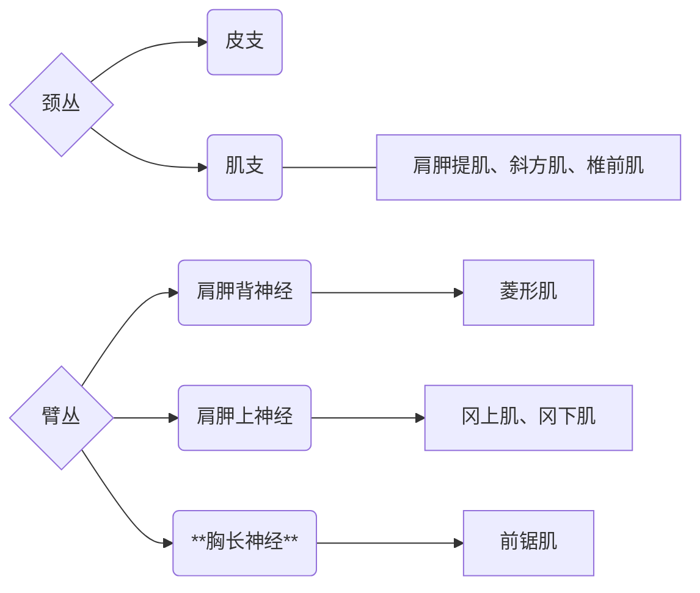

> [!NOTE] 知识目标
> 1. 掌握颈动脉三角的构成、内容物及毗邻关系
> 2. 掌握颈动脉鞘内容物及其毗邻
> 	- 颈总/颈内/颈外/锁骨下动脉的起止、行径、主要分支分布
> 	- 颈内/颈外/锁骨下静脉的起止、行径、主要属支
> 1. 掌握甲状腺的位置、毗邻、血供及固定装置。手术中甲状腺区及颈部气管前方的层次。甲状腺动脉和神经的毗邻及其临床意义
> 2. 掌握椎动脉三角的境界及内容
> 3. 掌握锁骨下动脉的起止、行径、主要分支分布；锁骨下静脉的起止、行径、主要属支
> 4. 掌握斜角肌间隙的构成及内容物
> 	- 颈丛的组成、位置、分支分布概况
> 	- 颈丛皮支浅出点（神经点）
> 	- 臂丛锁骨上部的行径，主要分支分布
> 1. 颈部交感干的组成、位置


# （一）概述
## 1. 境界
1. 上界：下颌骨下缘、下颌角、 乳突尖、上项线、枕外隆突
2. 下界：胸骨颈静脉切迹、胸锁 关节、锁骨上缘、 肩峰和 C7颈椎（隆椎）棘突
## 2. 分区
1. 颈部
	1. 颈前区
		- 舌骨上：
			- 颏下三角
			- 下颌下三角
			- *分界：二腹肌*
		- 舌骨下：
			- 颈动脉三角
			- 肌三角
			- *分界：下颌舌骨肌*
	2. 颈外侧区
		- 枕三角
		- 锁骨上三角（锁骨上大窝）
	3. 胸锁乳突肌区和颈根部
2. 项部


# （二）颈部层次
## 浅层

- 皮肤
- 浅筋膜
	1. **==颈阔肌==**
	2. 浅静脉（颈前v，颈外v）
	3. 皮神经
		1. 颈丛（枕小，耳大，颈横，锁骨上）
		2. 面神经颈支
## 深层

### 颈筋膜
#### 1. 封套筋膜
#### 2. 气管前筋膜
#### 3. 椎前筋膜


### 颈筋膜间隙
#### 1. 胸骨上间隙
#### 2. 锁骨上间隙
#### 3. 气管前间隙
#### 4. 椎前间隙
#### 5. 咽后间隙
### 颈动脉鞘


---

# （三）颈肌


| 层次  | 区域             | 肌肉        |
| --- | -------------- | --------- |
| 浅层  |                | **颈阔肌**   |
|     |                | **胸锁乳突肌** |
| 中层  | 舌骨上（抬舌骨、拉低下颌骨） | **二腹肌**   |
|     |                | **茎突舌骨肌** |
|     |                | **下颌舌骨肌** |
|     |                | **颏舌骨肌**  |
|     | 舌骨下（降舌骨、增大口腔）  | **胸骨舌骨肌** |
|     |                | **肩胛舌骨肌** |
|     |                | **胸骨甲状肌** |
|     |                | **甲状舌骨肌** |
| 深层  | 外侧             | **前斜角肌**  |
|     |                | **中斜角肌**  |
|     |                | **后斜角肌**  |
|     | 内侧             | **头长肌**   |
|     |                | **颈长肌**   |

*前斜角肌-中斜角肌（均止于第一肋）：斜角肌间隙* 有锁骨下动脉和臂丛穿过
*后斜角肌*：深呼吸拉肋骨向上，止于第2肋


---
# （四）颈部血管
## 动脉系统：
#### 1. 颈总动脉
#### 2. 颈内动脉
#### 3. 颈外动脉
#### 4. 锁骨上动脉
## 静脉系统：
#### 1. 颈内静脉
- 属支：面静脉，舌静脉，甲状腺上静脉，甲状腺中静脉
- 位置：胸锁乳突肌前缘深面
#### 2. 锁骨下静脉
#### 3. 颈外静脉与颈前静脉


---
# （五）颈部神经
## 1. 颈丛
1. 皮支（见前）
	- 枕小、耳大、颈横、锁骨上
		- 
2. 肌支：膈神经（走行于前斜角肌表面）和颈袢（支配舌骨下肌群）
	- 
## 2. 颅神经
#### 1. 舌咽神经（9）
#### 2. 迷走神经（10）
> 迷走神经vagus nerve

[](8%20颈部2-蒋磊.pdf#page=12&selection=17,0,20,5|8%20颈部2-蒋磊,%20页面%2012)
- 行程
- 分支
#### 3. 副神经（11）
#### 4. 舌下神经（12）
> 舌下神经hypoglossal nerve

[](8%20颈部2-蒋磊.pdf#page=11&selection=35,0,36,17|8%20颈部2-蒋磊,%20页面%2011)
- 行程
- 分支
- ==颈袢==来源和组成：


---

---
- Ticket
	- 

---
# （六）淋巴

颈外侧深淋巴结
1. 颈内静脉前淋巴结
2. 颈内静脉外侧淋巴结


颈前深淋巴结
- 喉前淋巴结
- 甲状腺淋巴结
- 气管前淋巴结
- 气管旁淋巴结


---

# ※颈部结构

## 颈前区

### 颏下三角
### 下颌下三角
### 颈动脉三角
### 肌三角
- 境界
- 内容物： 舌骨下肌群 • 甲状腺 • 甲状旁腺 • 气管颈部 • 食管颈部
###### 甲状腺
1. 形态和位置
	1. 上接喉（环状软骨下缘），下接气管胸部（胸廓上口）。由C形气管软骨环构成。
	2. 位于颈前正中线，食管前方。上平C6椎体下缘，下平胸骨颈静脉切迹水平
	3. 毗邻关系

2. 甲状腺被膜
	2. 
3. 毗邻
	- 前面：皮肤-浅筋膜-封套筋膜-舌骨下肌群-气管前筋膜
	- 侧叶后内：喉和气管、咽和食管、*喉返神经*
	- 侧叶后外：颈动脉鞘（颈总动脉、颈内静脉、迷走神经）、颈交感干
- **甲状腺肿大的临床表现**（4）
4. 甲状腺的动脉和喉的神经
	1. 甲状腺上动脉、喉上神经
	2. 甲状腺下动脉、喉返神经
		1. 甲状腺下动脉
		2. 喉返神经
			1. 迷走神经分支，左-勾绕主动脉弓，右-勾绕右锁骨下动脉
			2. 后下神经-支配除环甲肌以外所有喉肌
	3. 甲状腺最下动脉
	
5. 甲状腺静脉
###### 甲状旁腺
- 颜色和形态
- 位置（上、下）
- 功能：钙磷代谢相关
- *甲状腺全切：保留*
###### 食管颈部
- 位置：上接喉咽（环状软骨下缘），下接食管胸部（胸廓上口）。扁平肌管。位于气管后方，椎前筋膜和颈椎前方
- 毗邻：

###### 气管颈部
- 位置：上接喉（环状软骨下缘），下接气管胸部（胸廓上口）。由C形气管软骨环构成。位于颈前正中线，食管前方。上平C6椎体下缘，下平胸骨颈静脉切迹水平。


## 胸锁乳突肌区
1. 范围
2. 内容
	1. 颈动脉鞘
	2. 颈袢
		1. 位置
		2. 组成
			1. 上根：舌下神经
			2. 下根：2、3颈神经
	3. 颈丛
		1. 第1-4颈神经
		2. 胸锁乳突肌上部深面、
		3. 分支：皮支、肌支、膈神经
	4. 颈交感干


## 颈外侧区
### 枕三角
- 境界
- 内容
###### 1. 副神经
- 
- 
###### 2. 颈丛、臂丛


### 锁骨上三角
- 境界
- 内容
###### 锁骨下静脉&静脉角
###### 锁骨下动脉
###### 臂丛


## 颈根部

1. 内容：
	1. 胸膜顶
		- 高出锁骨内侧1/3上缘2~3cm
		- 毗邻【重要】
			- 前方：锁骨下动脉
			- 前外侧：前斜角肌、膈神经、迷走 神经、锁骨下静脉、胸导管颈部 （左）
			- 后方：第1、2肋、颈交感干，第1 胸神经前支
			- 外侧：中斜角肌、臂丛
	2. 锁骨下动脉
		- 走行：绕胸膜顶的前上方，向外穿斜角肌间隙，至第一肋外缘。以*前斜角肌*为界分为三段
	```mermaid
	graph LR
	A[第1段]
	A --> B[椎动脉]
	A --> C[胸廓内动脉]
	A --> D[甲状颈干]
	A --> E[肋颈干]
	D --> F[甲状腺下动脉]
	D --> G[颈横动脉]
	D --> H[肩胛上动脉]

	I[第2段] --- X[前斜角肌后方]
	J[第3段] --- Y[前斜角肌外侧]
	J --> Z[颈横动脉、肩胛上动脉]
	```

	3. 胸导管

	4. 右淋巴导管
		- 右颈干、右锁骨下干、右支气管纵隔干
	5. 锁骨下静脉

	6. 迷走神经
		- 
	7. 膈神经
		- 
	8. **椎动脉三角**
		- 境界
		- 内容


---
# 思考题
1. 试述颈动脉三角的境界，以及由浅入深的层次结构。 
2. 试述颈动脉鞘的位置，内容及毗邻关系。 
3. 简述甲状腺的形态、被膜、位置、毗邻、动脉与喉的神经的位置 关系及其临床意义。 
4. 试述甲状腺手术有浅入深经过哪些层次？ 
5. 名词解释：颈动脉鞘、颈袢、颈动脉窦、甲状腺悬韧带、甲状腺 囊鞘间隙
6. 锁骨下静脉与锁骨下动脉在颈根部的行走和局部位置有何不同? 
7. 试述前斜角肌的毗邻关系。 
8. 试述椎动脉三角的境界及内容。 
9. 简述胸膜顶的位置及其主要毗邻关系


---
# 要点：
1. 分区与三角
2. 层次与筋膜
3. 血管系统
4. 神经系统
5. 重要结构
6. 颈根部