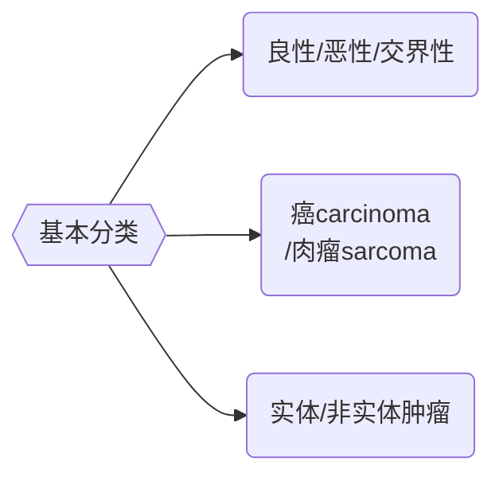

# 定义
- 机体细胞在各种始动与促进因素作用下产生的*增生与异常分化*所形成的*新生物*。新生物一旦形成，不因病因消除而停止增生；表现为*生长失控、破坏器官及周围组织*。
- **恶性肿瘤-癌症-生物学特征**：==浸润、转移、复发==



|        | 良性肿瘤                                   | 恶性肿瘤                                      |
| ------ | -------------------------------------- | ----------------------------------------- |
| 组织分化程度 | 分化好，异型性小                               | 分化不好，异型性大，与原有组织形态差别大                      |
| 核分裂像   | 无/稀少，无病理核分裂像                           | 多见，可见病理核分裂像                               |
| 生长速度   | 缓慢                                     | 较快                                        |
| 生长方式   | 膨胀性/外生性生长；<br>前者常有包膜，与周围组织分界清，通常推动包膜形成 | 浸润性//外生性生长；<br>前者无包膜，分界不清，不能推动。后者常伴有浸润性生长 |
| 继发改变   | 很少发生坏死、出血                              | 常发生出血、坏死、溃疡等                              |
| 转移     | 不转移                                    | 常有转移                                      |
| 复发     | 手术切除后很少复发                              | 较多                                        |
| 对机体影响  | 较小，主要为局部压迫或阻塞                          | 压迫/坏死+破坏原发和转移处的组织，引起坏死、出血、合并感染，甚至恶病质      |
光滑边界清楚的也会恶性和转移（胃肠间质瘤 GIST）

|       | 癌                      | 肉瘤            |
| ----- | ---------------------- | ------------- |
| 组织来源  | 上皮组织                   | 间叶组织          |
| 发病率   | 常见，多见于>40岁成人           | 较少见，大多见于青少年   |
| 大体特点  | 质较硬，色灰白，较干燥            | 质软，色灰红，湿润，鱼肉状 |
| 组织学   | 多形成癌巢，实质与间质分界清，纤维组织无增生 | 肉瘤细胞多弥漫分布     |
| 实质与间质 | 分界不清                   | 间质内血管丰富，纤维组织少 |
| 网状纤维  | 无                      | 肉瘤细胞间多有网状纤维   |
| 转移    | 淋巴道                    | 血道            |


|       | 肿瘤性增生                            | 非肿瘤性增生                             |
| ----- | -------------------------------- | ---------------------------------- |
| 增生性   | 肿瘤细胞生长旺盛并有相对自主性，致瘤因素不存在时仍能持续性生长  | 有一定限度，增生原因消除后不再继续增生                |
| 异型性   | 肿瘤细胞具有异常形态、代谢和功能，并在不同程度上失去分化成熟能力 | 增生的细胞/组织能分化成熟，并在一定程度能恢复原正常组织的结构和功能 |
| 对机体影响 | 与机体不相协调，有害无益                     | 属于正常新陈代谢所需的细胞更新；有的是针对一定刺激/损伤的适应性反应 |

# 现状
# 病因与发病机制
- 病因
	- 环境因素（始动因素）
		- 物理
		- 化学
		- 生物
	- 机体因素（本质因素）
		- 遗传
		- 内分泌
		- 免疫
		- 心理&社会
- 发病机制：不清！
	- 原癌基因、癌基因、抑癌基因
	- 凋亡调节基因和DNA修复调节基因
	- 端粒和肿瘤
	- 多步癌变的分子基础
	- 免疫
# 诊治与随访
### 诊断
- 病史和查体
	- 局部表现（肿块、疼痛、溃疡、出血、梗阻、转移症状）
	- 全身症状
- 实验室诊断
	- 三大常规
	- 血清学（肿瘤标志物）
	- 基因检测
- 影像学和内镜诊断
	- X线、CT、超声、MRI、PET
	- 内镜检查
- 病理学诊断
	- 临床细胞学检查
	- 病理组织学检查
> 临床诊断：病史、体检、影像、内镜……--临床分期--术前
> 病理诊断：性质（术前）、大小、分化、浸润转移等--病理分期--术后

### 治疗
##### 1. 手术治疗
- 手术方式：
	- 预防性手术：用于治疗癌前病变，防止其恶变或发展成进展期癌
	- 诊断性手术：切取活检、切除活检、剖腹探查术
- 基本原则：
	- 不切割原则（足够切缘和先血管后肿瘤）
	- 整块切除原则
	- 无瘤技术原则
- 手术类型：
	- 根治性手术：指手术范围包括肿瘤全部及其在器官或组织的大部分或全部切除,必要时还要将该部位周围的淋巴结整块切除,即所谓根治术,如乳腺癌、直肠癌、宫颈癌、头颈部肿瘤的根治术。
	- 减瘤手术：为那些单靠手术无法根治的恶性肿瘤做大部切除,术后继以其它非手术治疗,诸如化疗、放疗,生物治疗等,以期改善并延长患者的生存。
	- 姑息性手术：对于晚期肿瘤,由于切除原发灶或转移灶达不到根治,而做一些简单的手术,旨在防止和解除可能发生的症状,以提高生存质量。常用的姑息性手术有:各种造痿术,如胃、空肠、结肠造痿,器官部分或全部切除,肠管吻合转流术等
	- 重建、再造与康复手术：如:消化道的重建、乳腺癌根治术后乳房再建、巨大肿瘤切除后胸壁重建、腹壁重建已广泛开展。
- 优缺点：
	- 优势：
		- 肿瘤对外科切除没有生物抵抗性(0级动力学)
		- 外科手术没有潜在的致癌作用
		- 治疗效果不受肿瘤异质性的影响
		- 外科能根治很大一部分没有扩散的实体瘤
		- 提供准确的肿瘤病理分期和组织学特征
	- 局限：
		- 切除术对肿瘤组织并无特异性,即正常组织和肿瘤组织同样受到破坏
		- 外科治疗可能出现威及生命的并发症,并可造成畸形和功能丧失
		- 肿瘤如果超越局部及区域淋巴结时不能用手术治愈

##### 2. 化学疗法
> 术前化疗：缩减肿瘤体积
> 	- 为无法手术的患者创造手术机会
> 	- 手术时肿瘤细胞活力降低，不易扩散
> 	- 杀死微转移肿瘤细胞
> 	- 评估肿瘤细胞对化疗药的反应
> 术后化疗：控制复发，延长生存


- 分类：
	- 诱导化疗
	- 辅助化疗
	- 新辅助化疗
	- 姑息化疗
	- 特殊途径化疗
- 化疗药物的毒副反应
（[../../../疾病模块/消化与内分泌系统Ⅰ[2](../../../疾病模块/消化与内分泌系统Ⅰ[2)，[../../../疾病模块/消化与内分泌系统Ⅰ[2](../../../疾病模块/消化与内分泌系统Ⅰ[2)）
	1. 骨髓抑制：白细胞、血小板减少
	2. 消化道反应：恶心、呕吐、腹泻、口腔溃疡【抗代谢类】
	3. 毛发脱落【蒽环类】
	4. 血尿【异环磷酰胺】
	5. 免疫功能降低，易并发细菌/真菌感染


##### 3. 分子靶向治疗
例：GIST

### 随访
- 目的
	- 早期发现有无复发或转移病灶
	- 为临床科研服务
	- 对肿瘤病人有心理治疗和支持作用
- 肿瘤手术治疗后的3种转归：
	1. 临床治愈
	2. 恶化
	3. 复发（随访年限各异）
- 预后取决于：①肿瘤的分子生物学行为；②第一次治疗正确与否


[](外科学.pdf#page=187&selection=2,0,6,0|外科学,%20页面%20187)

---
```dataviewjs
// =====================================================
// 链接关系仪表盘（稳定版） — 纯 DOM 渲染，避免 Dataview 元素类型问题
// =====================================================
const cur = dv.current();
const filePath = cur?.file?.path ?? null;

// === 辅助函数 ===
function extractPath(item){
    if(!item) return null;
    if(typeof item === "string") return item;
    if(item.path) return item.path;
    if(item.file && item.file.path) return item.file.path;
    return null;
}
function isValidNote(path){
    if(!path) return false;
    const lower = path.toLowerCase();
    return !lower.match(/\.(png|jpg|jpeg|gif|svg|webp|mp4|mov|zip|json|csv|xlsx|docx)$/);
}
function displayNameFor(path){
    const pg = dv.page(path);
    return pg?.file?.name ?? path.split('/').pop();
}

// === 获取出链（多重兼容） ===
let outRaw = [];
try {
    if(typeof dv.outgoing === "function" && filePath) outRaw = dv.outgoing(filePath);
    else if (cur?.outlinks) outRaw = cur.outlinks;
    else if (cur?.file?.outlinks) outRaw = cur.file.outlinks;
} catch(e) { outRaw = []; }
const outPaths = [...new Set((outRaw || []).map(extractPath).filter(isValidNote))];

// === 获取反链（优先 dv.incoming，否则全库扫描） ===
let inRaw = [];
try {
    if(typeof dv.incoming === "function" && filePath) inRaw = dv.incoming(filePath);
    else {
        inRaw = dv.pages().where(p => {
            try {
                const ol = p.file?.outlinks ?? p.outlinks ?? [];
                return ol.some(l => extractPath(l) === filePath);
            } catch(e){ return false; }
        }).array();
    }
} catch(e) { inRaw = []; }
const inPaths = [...new Set((inRaw || []).map(extractPath).filter(isValidNote))];

// === 使用纯 DOM 构建视图 ===
const container = document.createElement("div");
container.className = "link-dashboard";

// 卡片构造器（返回 DOM 节点）
function createCard(title, paths, emptyMsg, icon){
    const card = document.createElement("div");
    card.className = "link-card";

    const h3 = document.createElement("h3");
    h3.textContent = `${icon} ${title} (${paths.length})`;
    card.appendChild(h3);

    if(paths.length){
        // 排序
        paths.sort((a,b) => (displayNameFor(a) ?? a).localeCompare(displayNameFor(b) ?? b));
        const ol = document.createElement("ol");
        for(const p of paths){
            const li = document.createElement("li");

            const a = document.createElement("a");
            a.href = "#";
            a.textContent = displayNameFor(p);
            a.style.cursor = "pointer";

            // 点击通过 Obsidian API 打开链接（在新 leaf）
            a.addEventListener("click", (e) => {
                e.preventDefault();
                try {
                    app.workspace.openLinkText(p, "", true);
                } catch(err) {
                    // 回退尝试按显示名打开
                    try { app.workspace.openLinkText(a.textContent, "", true); } catch(e2){ console.error(e2); }
                }
            });

            li.appendChild(a);
            ol.appendChild(li);
        }
        card.appendChild(ol);
    } else {
        const p = document.createElement("p");
        p.textContent = emptyMsg;
        p.style.opacity = "0.75";
        card.appendChild(p);
    }

    return card;
}

// 插入卡片
container.appendChild(createCard("本文引用的笔记", outPaths, "📭 本文未引用其他笔记。", "📓"));
container.appendChild(createCard("引用了本文的笔记", inPaths, "📪 目前没有笔记引用本文。", "📑"));

// 将纯 DOM 容器挂到 Dataview 输出区域（稳健方式）
dv.container.appendChild(container);


```
