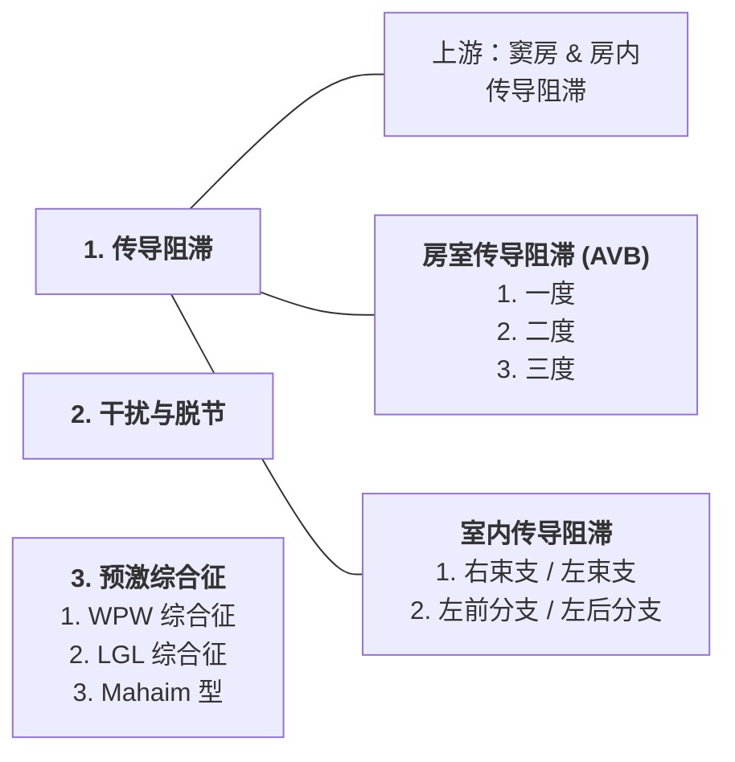

> [!大纲]
> - 基本知识：产生原理、各波段组成的命名、导联系统
> - 测量和正常数据
> - 需掌握的心电图改变：
> 	1. 心房肥大和心室肥厚（左右）
> 	2. 心肌缺血、心肌梗死
> 	3. 心律失常（窦性心律失常、期前收缩、异位性心动过速、扑动与颤动、传导异常）
> 	4. 电解质紊乱和药物的影响（高血压、低血钾、高低血钙、洋地黄）

# 一、基本知识
### （一）心电图产生原理
- 心肌细胞静息状态：膜外排列阳离子-正电荷；膜内同等比例阴离子。平衡的极化状态。
- *心电向量* ^4ab973
### （二）心电图各波段的组成和命名
- 心脏特殊传导系统：窦房结--心房--结间束--房室结--希氏束--左右束支--浦肯野纤维--心室

| 波形    | 意义             | 时间         |
| ----- | -------------- | ---------- |
| P波    | 左右心房除极         | ≤0.12s     |
| P-R间期 | 心房除极开始--心室开始除极 | 0.12-0.20s |
| QRS波群 | 心室除极的全过程       | 0.06-0.10s |
| ST段   | 心室缓慢复极-等电位线    |            |
| T波    | 心室快速复极         |            |
| Q-T间期 | 心室开始除极--心室复极完毕 | 0.32-0.44s |

### （三）心电图导联体系
#### 1. 肢体导联（标准：Ⅰ Ⅱ Ⅲ）（加压：aVR aVL aVF）

- 额面六轴系统：以上6个导联的轴一并通过坐标图轴的中心点。左侧为0°，顺时钟为正向。每个相邻导联夹角30°
#### 2. 胸导联 V1-V6

- 附加导联：V7-9，V3R-V5R
	- 后壁心肌梗死：V7-V9
	- 右心病变/小儿心电图：V3R-V5R
# 二、心电图的测量和正常数据

- 心电图纸：
	- 横坐标：每小格=0.04s，每大格=0.2s
	- 纵坐标：每小格=0.1mV，定标电压1cm=1mV

**==心电图评估5步法==**

#### 1. 频率
【正常】60-100次/分
	1. 心电图左上角：有风险但往往正确
	2. 【节律规整】300法：数R-R间期的大格数，300/大格数=HR
	3. 【节律不规整】6秒法：6s内（30大格）有多少心搏数，乘以10即可
#### 2. 节律
1. 判断是否为窦性波：I，II，avF导联P波正向
2. 窦性P波是否有规律：每个QRS波前应有1个P波
3. PR间期代表通过房室结的传导：异常？某种AVB
4. 窄QRS波(<120ms，3小格)：通过房室结激活心室
5. 宽QRS波：室内传导阻滞或搏动来源于心室
6. 其他节律：房颤、房扑、房性、交界性、室性
#### 3. 心电轴
- 判断偏向：
	- Ⅰ，Ⅲ均为正--不偏
	- Ⅰ负Ⅲ正-------右偏（尖对尖）【90~180°】
	- Ⅰ正Ⅲ负-------左偏（口对口）【-90°~-30°】

#### 4. 间期
【形状和宽度】
- P波大小： ^fa41a8
	- 值：正常≤0.12s
	- 方向：Ⅰ，Ⅱ，aVF向上，aVR向下
	- 检查有无心房扩大（Ⅱ导联最明显）
- PR间期：
	- 正常：0.12-0.20s
	- 房室传导阻滞(P-R>200ms)
	- 心室预激(P-R<40ms)
- QRS波大小：
	- V5-6 R波<2.5mV，胸导联R波V1-5递增
	- 电压高：左心室肥厚
	- 电压低：心包积液
- QRS波间期：
	- 0.06-0.10s
	- 宽QRS波(>120ms)：左右束支阻滞、心室内传导阻滞、室性搏动--心脏收缩不协调
- QT间期：
	- 与心率快慢密切相关，心率越快，QT间期越短
	- 0.32-0.44s
	- 长QT间期：hypos，antis，先天性综合征，颅内出血，心肌缺血
#### 5. 损伤
- 基线：T波结束至下一个P波开始之间的段称为 T-P段，连续两个TP段之间的线为基线/等电线
- J点：QRS波群终末与ST段起始的交接点
- *ST段抬高*：J点后0.08s（心动过速时0.06s）
	- 正常人ST段抬高于肢体导联不超过1mm，V1-3不超过3mm，V4-6不超过1mm
- *ST段压低*：
	- 心室率增快：ST段上斜型压低，压低幅度以J点后60/80ms计（有异议）
	- ST段压低类型：以R波垂直线和ST延长线夹角判断。>90°上斜型
	- 不作定性解释
- *T波*：正常形态慢上升快下降，方向同主波，倒置深度<0.25mV
	- 肢体导联<0.5mV，胸导联<1mV
- *病理性Q波*：宽且深，>0.04s，振幅>同导联R波的1/4

==心肌梗死：定位、图形演变、分期（见后）==

# 三、心房肥大和心室肥厚
## （一）心房肥大
#### 1. 右心房肥大
1. 下壁导联P波高尖，振幅≥0.25mV【肺型P波】
2. V1导联P波直立，振幅≥0.15mV
3. 多见于ASD，TOF，PS，COPD等引起右房扩大疾病
#### 2. 左心房肥大
1. P波增宽≥0.12s，常呈双峰，峰距≥0.04s
	- 
2. PtfV1≤0.04mm·s
3. 多见于MS，ASD等引起左房肥大疾病
#### 3. 双心房肥大
## （二）心室肥厚
#### 1. 左心室肥厚
1. 左室高电压（RV5，V6>2.5mV）
2. ST-T段改变（左侧导联）
3. 多见于高心、风心、心肌病等引起左室肥大疾病
#### 2. 右心室肥厚
1. 电轴右偏
2. V6呈rS型（明显顺时钟向转位），RV1>1mV
3. 见于PS，MS，肺心病等引起右室肥大疾病
#### 3. 双侧心室肥厚
# 四、心肌缺血
## （一）心肌缺血的心电图类型
1. 缺血型心电图改变
	1. 心内膜下心肌缺血--T波高耸
	2. 心外膜下心肌缺血--T波深倒
2. 损伤型心电图改变
	1. 心内膜下心肌损伤--ST段压低
	2. 心外膜下心肌损伤--ST段抬高
## （二）临床意义
## （三）鉴别诊断

# 五、心肌梗死
## （一）基本图形及机制

1. “缺血型”改变：T波改变（倒置）
2. “损伤型”改变：ST段弓背抬高
3. “坏死型”改变：病理性Q波
*振幅≥1/4R，时限≥0.04s*
## （二）心肌梗死的心电图演变及分期

1. 超急性期
2. 急性期
3. 亚急性期
4. 陈旧期
## （三）心肌梗死的定位诊断及梗死相关血管的判断

| 位置   | 对应导联            |
| ---- | --------------- |
| 前间壁  | V1 V2 (V3)      |
| 前壁   | (V2) V3 V4 (V5) |
| 前侧壁  | (V4) V5 V6 (V7) |
| 高侧壁  | Ⅰ aVL           |
| 下壁   | Ⅱ Ⅲ aVF         |
| 广泛前壁 | V1-V6 (Ⅰ aVL)   |
| 正后壁  | V7-V9           |
| 右室   | V3R-V5R         |

> [!NOTE]
> ==冠状动脉解剖==
> ├── *右冠状动脉* (RCA)
> │   ├── 锐缘支 (AM)
> │   ├── 左室后支 (PLA)
> │   └── 后降支 (PDA)
> │
> └── *左主干* (LM)
>     ├── 左前降支 (LAD)
>     │   ├── 间隔支 (S)
>     │   └── 对角支 (D)
>     │
>     └── 左回旋支 (LCX)
>         └── 钝缘支 (OM)

| 心脏壁 | 血管        | 相关导联        |
| --- | --------- | ----------- |
| 间隔  | LAD-间隔支   | V1 V2       |
| 前壁  | LAD-对角支   | V2-V4       |
| 侧壁  | LCX 左回旋支  | Ⅰ aVL V5 V6 |
| 后壁  | RCA 或 LCX | V7-V9       |
| 下壁  | RCA 或 LCX | Ⅱ Ⅲ aVF     |
| 右室  | RCA（近段）   | V3R-V5R     |

## （四）心肌梗死的分类及鉴别诊断

> 1. Q波型和非Q波型心肌梗死
> 2. ST 段抬高型和非 ST 段抬高型心肌梗死
> 3. 心肌梗死合并其他病变
> 4. 心肌梗死的鉴别诊断

#### ST段抬高型心肌梗死 STEMI
#### 非ST段抬高型心肌梗死 NSTEMI

# 六、心律失常
### （一）概述
### （二）窦性心律及窦性心律失常
1. 窦性心律的心电图特征
2. 窦性心动过速
3. 窦性心动过缓
4. 窦性心律不齐
5. 窦性停搏
	- 窦性P波规则发放，突然出现P波脱落形成长PP间期，且长PP间期与窦性PP不成倍数关系，停搏后常出现逸搏或逸搏心律
	- 心肌炎、心肌病、冠心病等疾病引起的窦房结功能障碍，也可见迷走神经张力增大
6. 病态窦房结综合征 (sick sin us syndrome, SSS )
---
## （三）期前收缩(早搏)

>定义：窦房结以外的*异位起搏点* 过早发出冲动控制心脏收缩所致；临床上最常见的心律失常。房性、室性多见，交界性较少见。
>
> - 联律间期：异位搏动与其前窦性搏动之间的时距
> - 代偿间期：期前出现的异位搏动代替了一个正常窦性搏动，其后出现一个较正常心动周期更长的间歇。
> - 二联律：期前收缩与窦性心搏交替出现
> - 三联律：每2个窦性心律后出现1次期前收缩
#### 1. 室性期前收缩
==【ECG表现】==
1. *提前出现宽大畸形的QRS-T波群*，QRS ≥0.12s
2. 提前出现的QRS波群前*无相关P波*
3. ST段，T段与QRS主波方向相反
4. 多为完全性代偿间歇（期前收缩前后两个窦性P波的间距=正常P-P间距的两倍）

#### 2. 房性期前收缩
==【ECG表现】==
1. *提前出现的P'波*，形态与窦性P波略有不同
2. P' R间期≥0.12s
3. 多为不完全代偿间歇（期前收缩前后两个窦性P波的间距小于正常P-P间距的两倍）
#### 3. 交界性期前收缩
1. 逆行P' 波出现在QRS波之前(P'-R<0.12s)
2. 逆行P' 波出现在QRS波之后(R-P'<0.20s)
3. 多为完全代偿间歇

---
## （四）逸搏与逸搏心律

>**逸搏**：交界区、心室、心房的起搏点以固定频率发放1-2个心搏
>**逸搏心律**：连续发放≥3个逸搏
>- 一种被动的异位节律；常继发于窦缓、窦房结停搏、窦房传导阻滞、房室传导阻滞等；避免引起长时间的停搏，是一种心脏保护机制
>- 过缓的逸搏心律可引起循环功能障碍，更易发展为停搏而发生阿斯综合征
>

1. 房性逸搏心律
2. 交界性逸搏心律
3. 室性逸搏心律
4. 反复搏动

## （五）异位性心动过速
### 1. 阵发性室上性心动过速
1. 窦性心动过速
2. 房性心动过速
3. 心房颤动、心房扑动
4. 交界性心动过速
##### 5. 房室结折返性心动过速 AVNRT
【慢-快型房室结折返性心动过速】
- 房室结双径路：在房室交界区域存在两条传到性能不同的径路（一快一慢）
	- *慢径路α*：传导速度慢，不应期短
	- *快径路β*：传导速度快，不应期长
- 折返：先从α下行，到达AV结之后，下传心室+沿β逆行回心房。**α下β上**
##### 6. 房室折返性心动过速 AVRT
【顺向型房室折返性心动过速】
- *隐匿性旁道* 无前传功能，无论窦性心律还是心房起搏时从不显示心室预激
	- 具有良好**逆传功能**，形成房室折返环路
### 2. 室性心动过速 VT

> 起源于希氏束分叉以下、左室或右室，至少连续≥3个、频率100-250次/分的心动过速
###### 病因：
1. 冠心病（尤其是AMI）
2. 心肌病（尤其是扩心和肥心）
3. 心瓣膜病、急性心肌炎、先心病、心包炎等
4. 抗心律失常药、拟交感胺类药物、青霉素过敏等
5. 电解质紊乱和酸碱失衡
6. QT延长综合征引起的VT
7. 无器质性心脏病者--特发性VT
###### 分类：
1. 室速持续时间：
	1. 非持续性：<30s，通常无症状
	2. 持续性：>30s，常伴有血液动力学变化

- 看见房室分离即诊断宽QRS波心动过速为室性心动过速
### 3. 非阵发性心动过速
### 4. 双向性室性心动过速
### 5. 扭转型室性心动过速
- 尖端扭转型室性心动过速：QT延长
---
## （六）扑动与颤动
#### 1. 心房扑动 AFL
==ECG特点==
1. *P波消失，代之以大小、形态、间隔相同的F波，在Ⅱ、Ⅲ、aVF最清楚*
2. F波与QRS波群可呈某种固定比例，常为2:1和4:1房室传导，有时比例不固定
3. QRS波群一般形态正常，伴有室内差异性传导者QRS波增宽、变形

#### 2. 心房颤动 AF
==ECG特点==
1. 窦性P波消失，代之以*大小、形态、间距不一*的F波，频率350-600次/分，在V1导联最清楚
2. *RR间隔绝对不规则*
3. QRS波群一般形态正常，伴有室内差异性传导者QRS波增宽、变形

#### 3. 心室扑动
- 由于心室扑动的心脏失去排血功能，因此常不能持久，如不能很快恢复，便会转为室颤而死亡
==ECG特点==
1. 无正常的QRS-T波群，代之以连续*快速而相对规则*的正弦波（室扑波）
2. 扑动波频率达200-250次/分

#### 4. 心室颤动
- 心室颤动常为心脏停跳前的短暂征象，心脏完全失去排血功能，是最严重的心律失常
==ECG特点==
1. QRS-T波群完全消失，出现*大小不等、极不匀齐*的低小波
2. 频率达200-500次/min

---
## （七）传导异常

---
### 房室传导阻滞

> 有效不应期ERP：无法传递电信号
> 相对不应期RRP：电信号传递慢---传导时间延长（P-R间期延长）
> 应激期：通道完全恢复
#### 一度A-V阻滞
- 相对不应期变长，AV结反应迟钝。每次激动都能下传心室，房室传导时间延长
- ECG：PR间期>0.2s，无脱落QRS波
#### 二度A-V阻滞
###### Ⅱ°Ⅰ型
- ERP变长，“逐渐疲劳”，不应期逐渐延长或信号落入RRP内的点越来越靠前--传到越来越慢，直到最后一次信号进入ERP内（QRS脱落）。*一部分室上性激动因阻滞而发生QRS波群脱落*
==ECG：**典型文氏现象**==
- P波规律出现
- *P-R间期进行性延长*，直至一个P波下传受阻而使相应的QRS波群脱落
- 在一个文氏周期中以第二个P-R间期的增量最大，此后进行性缩短，导致R-R间期进行性缩短
- QRS波群脱落形成的长R-R间期小于最短R-R间期的2倍
- 文氏周期反复出现

###### Ⅱ°Ⅱ型
- ERP大幅延长，RRP缩短。-->A-V结的性质变为全或无
==ECG：==
- *PR间期正常且固定*，部分P波后无QRS波群

#### 三度A-V阻滞
- 整个心动周期全为有效不应期
==ECG：逸搏心律==
- PP规则，RR规则，P与QRS无关，即完全性房室分离
- 心房率一般≤130bpm，心室率缓慢规则，一般≤45bpm；一般心房率快于心室率2倍
- 心室以交界性逸搏心律多见(40-60bpm)，或者室性逸搏心律(20-40bpm)

---
### 室内传导阻滞

#### 右束支传导阻滞 RBBB
右束支细而长，由单侧冠脉分支供血，容易缺血。其不应期比左束支长，故传导阻滞多见

#### 左束支传导阻滞
左束支粗而短，由双侧冠状动脉分支供血，不易发生传导阻滞。若发生多为器质性病变

---
### 预激综合征
==ECG特点：==
1. *PR间期<0.12s，PJ间期正常*
2. 在QRS波之前出现Δ波
3. QRS波增宽
4. 常有继发性ST-T波改变
# 七、电解质紊乱和药物影响
### （一）电解质紊乱
1. 高血钾
2. 低血钾
3. 高血钙和低血钙

### （二）药物影响
1. 洋地黄对心电图的影响
	1. 洋地黄效应
	2. 洋地黄中毒
2. 奎尼丁
3. 其他药物
# 八、心电图的分析方法和临床应用
