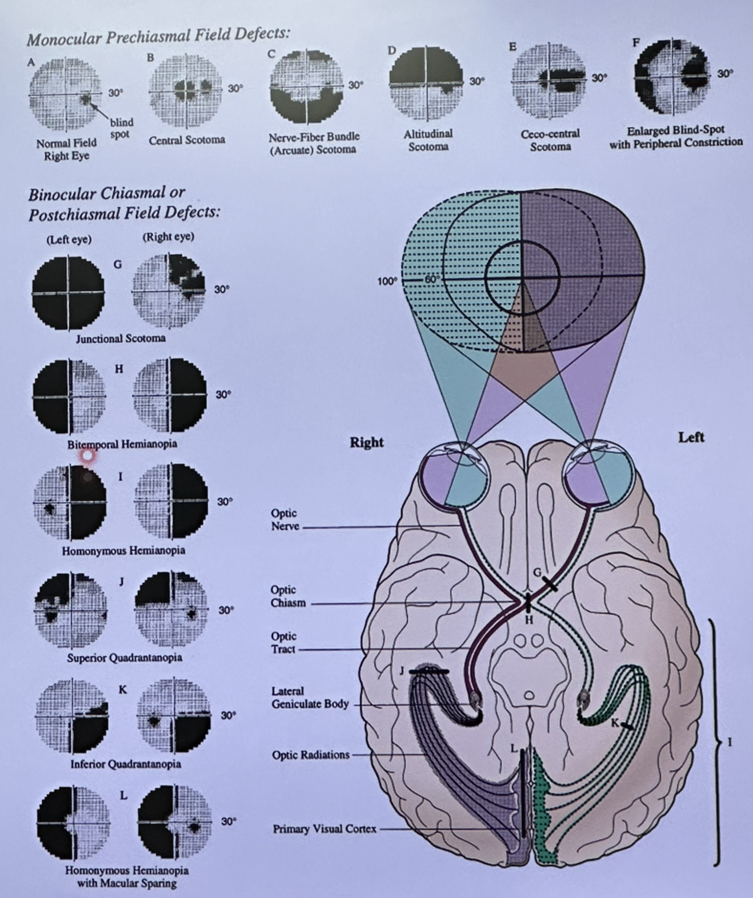
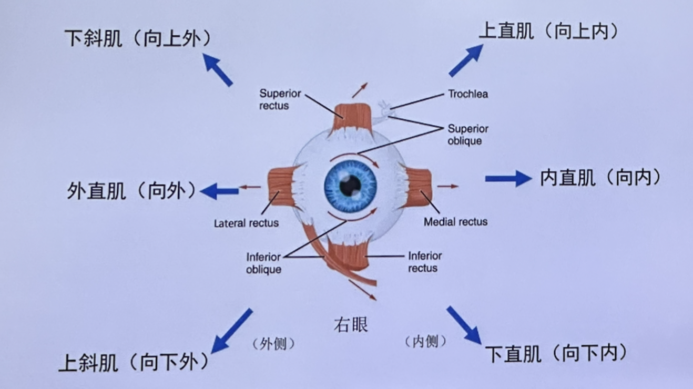
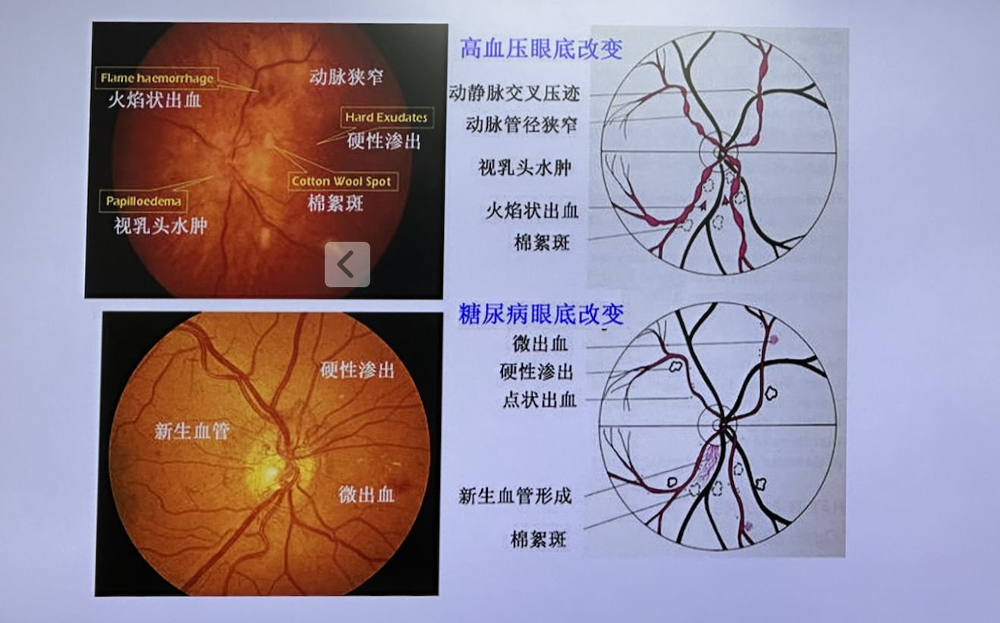

# 考试重点

## 眼的解剖和生理

| 眼球                                                         | 视路                       | 眼附属器                                      |
| ------------------------------------------------------------ | -------------------------- | --------------------------------------------- |
| 屈光介质组成（==角膜==、房水、==晶状体==、玻璃体）           | 眼内、眶内、管内、颅内段   | 眶上裂综合征（3、4、6和5眼支受累）、眶尖（2） |
| 眼球壁（三层）                                               | 视路损伤的定位（==视野==） | 泪道                                          |
| ==房水循环==                                                 |                            | 眼外肌                                        |
| 视网膜十层（由内向外）内界膜-神经纤维层-神经节细胞-内丛状层-内核层-外丛状层-外核层-==视感视锥细胞层==-视网膜色素上皮层 |                            | 眼睑（分层） 睑板腺腺体                  |

### 角膜Cornea

##### 【解剖】

1. 上皮细胞层
	1. ==再生能力强==，损伤后修复较快，不留瘢痕
	2. 有丰富的三叉神经末梢，知觉敏感
2. 前弹力层
	1. ==缺损后不能再生==，由纤维组织代替
3. 基质层
	1. 占全角膜厚度90%
	2. 由与角膜表面平行排列的胶原纤维形成的200-250层胶原板层构成
	3. ==损伤后不再生==；由不透明瘢痕组织替代
4. 后弹力层
	1. 由内皮细胞分泌的均质透明膜，实为内皮细胞基底膜
	2. ==损伤后可再生==
5. 内皮细胞层
	1. 紧贴于后弹力层后面，由一层六角形的细胞构成
	2. 具有角膜-房水屏障作用，维持角膜相对脱水状态，保持角膜透明，损伤后可引起基质层的水肿浑浊
	3. ==损伤后不能再生==，缺损区依靠邻近的内皮细胞扩展和移行覆盖

##### 【功能】

1. 维持眼球的完整及对眼内容物的保护
2. 透明：无血管--营养供应靠房水、泪膜、角膜缘血管网；纤维排列整齐；相对脱水的恒定状态
3. 屈光力强：43D（总屈光力的70%）
4. 感觉敏锐：丰富的神经末梢，自我保护

### 晶状体Lens

- 形态：双凸透明体；无血管
- 位置：虹膜、瞳孔之后、玻璃体之前
- 固定：360˚ 悬韧带连接晶状体赤道部与睫状体
- 营养来源：房水、玻璃体
- 主要功能：

	1. 屈光-双凸镜（19D）
	2. 调节：
	  - 睫状肌松弛-悬韧带拉伸-晶状体变薄-视远物清晰
	  - 随年龄增大晶状体弹性下降，睫状肌肌力下降，调节能力下降-->老视
	3. 滤过部分紫外线

### 房水Aqueous Humor

- 睫状突的上皮细胞产生
- 作用：维持眼内组织代谢和调节眼压
- 循环途径
	1. ==小梁网途径（主要途径）==
		- 睫状突上皮产生—后房—瞳孔—前房—前房角—小梁网 —Schlemm 管—集液管和房水静脉—睫状前静脉
	2. 葡萄膜巩膜通：10-20%
	3. 巩膜隐窝：5%

### 视网膜Retina

- 视网膜神经上皮层（感觉层）由三级神经元组成
	1. **第一神经元-光感受器-感光**
		1. ==视锥细胞==：司明视觉、色觉，主要分布在黄斑区。此区受损则可发生中心视力和色觉异常
		2. ==视杆细胞==：司暗视觉，主要分布在视网膜周边部。视杆细胞功能障碍时可产生夜盲症
	2. **第二神经元-双极细胞-联络**
	3. **第三神经元-神经节细胞-传导**
- 视觉的形成：光感受器感受光，形成神经冲动—双极细胞—神经节细胞—视中枢

### 视野

- 视路上任何一处病变，均会导致视野缺损，视野检查有利于对疾病的早期诊断和观察
- 

## 眼睑疾病

|      | 麦粒肿                                                       | 霰粒肿                                                       |
| ---- | ------------------------------------------------------------ | ------------------------------------------------------------ |
| 病因 | 是皮脂腺或睑板腺的急性化脓性炎症，是感染性疾病，常由葡萄球菌，特别是金黄色葡萄球菌引起。感染葡萄球菌后会引起化脓性的眼险皮肤或睑板腺、毛囊等炎症。 | 主要是因为睑板腺堵塞，分泌物潴留而形成的睑板腺慢性炎性肉芽肿。 |
| 部位 | 可以发生在险板腺的位置或眼睑皮肤毛囊皮脂腺或者汗腺等部位。   | 通常只发生在眼险的险板腺，所以发生部位也是不同的。           |
| 症状 | 感染性疾病-红肿热痛，疼痛明显                                | 基本不痛或轻微                                               |
| 治疗 | 热敷、局部使用抗生素眼药水/眼药膏，若破溃或过大则通过手术切排 | 按摩、热敷、手术治疗                                         |

## 角膜病

1. 不同细菌的角膜炎表现（葡萄球菌vs铜绿单胞菌）
2. 真菌性角膜炎：角膜刮片、培养、共焦显微镜找菌丝
	- 真菌性角膜炎临床表现：刺激症状轻、体征重
3. 植物-真菌；工伤-细菌；隐形眼镜-==棘阿米巴==；三叉神经范围-病毒
4. *棘阿米巴角膜炎*：角膜中央盘状溃疡，周边环形浸润；刮片找原虫。鉴别：单纯疱疹病毒性角膜炎

## 晶状体病

- 年龄相关性、并发性、后发性、代谢性、外伤性

- 分类：LOCS II（核、皮质、后囊）

- ==皮质性白内障分期==

	| 分期   | 表现                                                         |
	| ------ | ------------------------------------------------------------ |
	| 初发期 | 晶状体皮质不均匀混浊。可见空泡、水隙、楔形、轮辐状混浊       |
	| 膨胀期 | 未成熟期；皮质浑浊加重、肿胀，体积变大，虹膜前移，前房变浅   |
	| 成熟期 | 晶状体纤维脱水、全白，前房深度恢复正常                       |
	| 过熟期 | 体积变小、囊膜皱缩、表面钙化，前房加深。核下沉：Morgagnian白内障 |

- 后发性白内障：白内障术后、晶状体上皮细胞增殖；治疗：后囊激光

###### 白内障

1. 视力下降（最明显、最重要）
2. 对比敏感度下降
3. 屈光改变（“近视漂移”）
4. 单眼复视
5. 眩光-夜晚加重
6. 色觉改变、视野缺损等

## 青光眼

1. 原发性开角型青光眼

	- 眼压高、视神经损害、表现轻
	- 检查：眼压、房角镜、UBM、杯盘比、视野、视神经OCT
	- 治疗：**药物**、手术

2. 原发性闭角型青光眼

	| 分期             | 表现                                                         |
	| ---------------- | ------------------------------------------------------------ |
	| 临床前期         | 一眼已发生原发性急性闭角型青光眼，另一眼前房浅；或有原发性闭角型青光眼的阳性家族史，患眼前房浅、前房角窄，患者可无任何不适，激发试验阳性。 |
	| 前驱期           | 小发作，轻度阵发性视物模糊，虹视。休息后可缓解，可反复多次发作 |
	| ==急性发作期==   | 大发作，眼压急剧升高，剧烈头痛、眼痛，伴有恶心、呕吐、虹视，视力急剧下降。 球结膜混合充血，角膜雾状水肿，前房浅，前房角关闭，色素性KP，房水可有浑浊，甚至出现絮状渗出物；瞳孔中度散大，对光反射消失，常呈竖椭圆形。虹膜萎缩，青光眼斑，可有局限性瞳孔缘后粘连。 |
	| 缓解期（间歇期） | 不用药自行缓解，或停各种降眼压药物/仅用缩瞳药48h后眼压不再回升。前房角大部分或全部开放。 |
	| 慢性期（进展期） | 眼压下降，但未恢复正常；前房角部分关闭，周边部虹膜前粘连，视乳头出现凹陷扩大，盘沿变窄和猥琐等青光眼性改变，视力下降，视野出现青光眼性缺损。 |
	| 绝对期           | 无光感，眼压持续升高；自觉症状时消时现，有时会有剧烈疼痛； 球结膜混合充血；角膜混浊，可有大泡性角膜病变；视神经已遭严重损伤。 |

3. 正常眼压性青光眼

###### 药物

- 缩瞳剂：0.5%~2%毛果芸香碱滴眼液。缩瞳，解除瞳孔阻滞，房角粘连。
- β肾上腺能受体阻滞剂：0.5%噻吗心安滴眼液，美开朗，贝他根，贝特舒，每日2次。（==抑制房水生成==）
- α受体激动剂：溴莫尼定滴眼液，每日2-3次。（==抑制房水生成，促进房水流出==）
- 碳酸酐酶抑制剂：醋氮酰胺、尼目克司片 250mg，每日2次；布林佐胺滴眼液 每日2-3次。（==抑制房水生成==）
- 前列腺素衍生物：拉坦前列腺素素、贝美前列腺素、曲伏前列腺素（促进房水从==葡萄膜巩膜通路流出==）
- 脱水剂：50%甘油盐水口服，1g/kg；或20%甘露醇静脉滴注，1~2g/kg。（==脱水==）

###### 手术

- 激光：==虹膜周切术==
	- 选择性激光小梁成形术（SLT）
	- 虹膜成形术
	- 睫状体光凝术或冷凝术
- 非激光：虹膜周切术
	- ==小梁切除术==：MMC、羊膜、可调节缝线
	- 非穿透性小梁切除＋生物胶/T-Flux植入术
	- 小梁切开术（内/外路）
	- 減压阀植入术

## 葡萄膜病

| 疾病                           | 特点                                             |
| ------------------------------ | ------------------------------------------------ |
| ==前葡萄膜炎（虹膜睫状体炎）== | 强直性脊柱炎（？）；注意与结膜炎、青光眼鉴别诊断 |
| 中间葡萄膜炎                   | 玻璃体雪球状混浊，睫状体扁平部雪堤样改变         |
| 后葡萄膜炎                     | 视盘水肿，视网膜渗出、坏死                       |
| 交感性眼炎                     | 外伤                                             |
| VKH（？）                      | 双侧全葡萄膜炎，伴头痛、听力下降、毛色发白       |
| 白塞氏病                       | 口腔、皮肤、生殖器溃疡                           |
| 急性视网膜坏死                 | 单纯、带状疱疹病毒                               |
| Fuchs异色虹膜睫状体炎          |                                                  |
| 虹膜先天异常                   |                                                  |

治疗：糖皮质激素、免疫抑制剂、散瞳、抗炎抗感染

==虹膜睫状体炎==

- 结膜：睫状充血或混合充血
- 房水：闪辉、细胞
- 前房：积脓、积血、纤维絮状渗出
- ==KP==： 大小、形态、颜色、数量、分布
- 虹膜：水肿、粘连、结节、萎缩、膨隆、新生血管
- 瞳孔：==缩小==、闭锁、膜闭玻璃体：混浊
- 眼压：==正常==

## 眼外伤

| 病史采集                           | 检查                                                   | 临床表现与体征                         |
| ---------------------------------- | ------------------------------------------------------ | -------------------------------------- |
| 详细询问外伤经过                   | MRI（金属异物禁忌）                                    | 眼红痛，视力下降                       |
| 钝挫伤、穿通伤（异物位置、性质等） | CT                                                     | 角膜、巩膜创口（警惕隐匿性后巩膜创口） |
| 化学伤、辐射伤等                   | UBM、眼底荧光造影、B超（*开放性眼外伤未缝合前禁忌*）等 |                                        |

==急救处理原则==

1. 确认生命体征，如合并重要器官损伤，应该抢救生命基础上进行眼科处置；
2. 化学损伤、毒气损伤、热烧伤，尽快就地使用大量生理盐水或者清洁水冲洗眼睛；
3. 复杂性眼外伤如眼球挫伤、破裂损伤、眼内异物等，急诊行眼球破裂修补+异物取出；
4. 开放性损伤注射破伤风，全身抗炎、抗感染治疗

## 斜视与弱视

- 眼球运动基础理论：拮抗肌、配偶肌、肌肉主要作用
- 影像视觉发育的因素：先天（屈光不正、斜视等）、后天（视觉剥夺）
- 检查法：复像、角膜映光法、遮盖去遮盖、交替遮盖法
- 分类：共同性斜视、非共同性斜视（麻痹性、限制性）
- 特殊类型斜视：AV征、眼球后退综合征、先天性眼外肌纤维化
- 眼球震颤：特发性眼球震颤

###### 眼外肌

###### 弱视

- 定义：在视觉发育期由于单眼斜视、未矫正的屈光参差、高度屈光不正及形觉剥夺引起的单眼或双眼==最佳矫正视力低于相应年龄视力==称为弱视，或双眼视力相差2行及以上，视力较弱眼。
- 眼部无器质性病变

## 屈光不正

###### 近视与远视

###### 散光

- 第一种分类
	- 规则散光：最大屈光力和最小屈光力主子午线相互垂直者为规则散光。规则散光又分为顺规散光、逆规散光和斜轴散光。最大屈光力主子午线在90°士30°位置的散光称为顺规散光，最大屈光力主子午线在150°至180°、180°至30°称为逆规散光，其余为斜向散光。
	- 不规则散光：不相互垂直者为不规则散光。
- 第二种分类
	- 单纯近视散光：一主子午线像聚焦在视网膜上，另一主子午线像聚焦在视网膜之前。 exg: -2. ODC*180°
	- 单纯远视散光：一主子午线像聚焦在视网膜上，另一主子午线像聚焦在视网膜之后。exg: +2. ODC*90°
	- 复合近视散光：两主子午线像均聚焦在视网膜之前，但聚焦位置前后不同。 exg: -2. ODS/-2. ODC*180°
	- 复合远视散光：两主子午线像均聚焦在视网膜之后，但聚焦位置前后不同。 exg: +2. ODS/+2. ODC*90°
	- 混合散光：一主子午线像聚焦在视网膜之前，另一主子午线像聚焦在视网膜之后。 exg: -2. ODS/+3. ODC*90°

## 全身疾病眼部表现

- 内科疾病：==甲亢、糖网、高血压视网膜病变==
- 外科疾病：垂体瘤、骨折
- 儿科：ROP
- 神经精神：肿瘤、视神经脊髓炎
- 口腔：下颌瞬目综合征
- 皮肤：HIV、Steven-Johnson、SS、梅毒
- 全身免疫异常：SLE、强直、重症肌无力

###### 糖尿病眼部并发症

- 视网膜微血管病变：微血管瘤、渗出、出血、诱发新生血管等
- 代谢性白内障：晶体蛋白代谢异常
- 屈光改变：血糖突然增高会导致近视性屈光不正，反之经过治疗后当血糖降低时又会发生远视性屈光不正，且常伴有明显的散光
- 新生血管性青光眼：糖尿病会产生促血管生成因子，刺激虹膜小梁等结构域表面产生新生纤维血管膜
- 眼外肌麻痹、斜视
- 干眼症⋯
