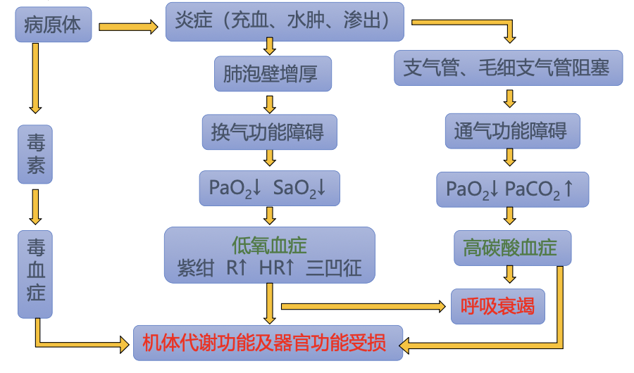
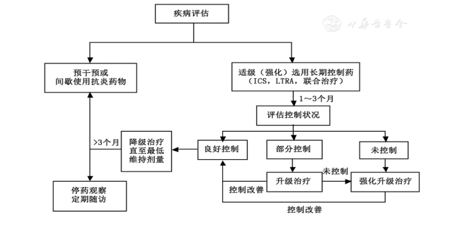
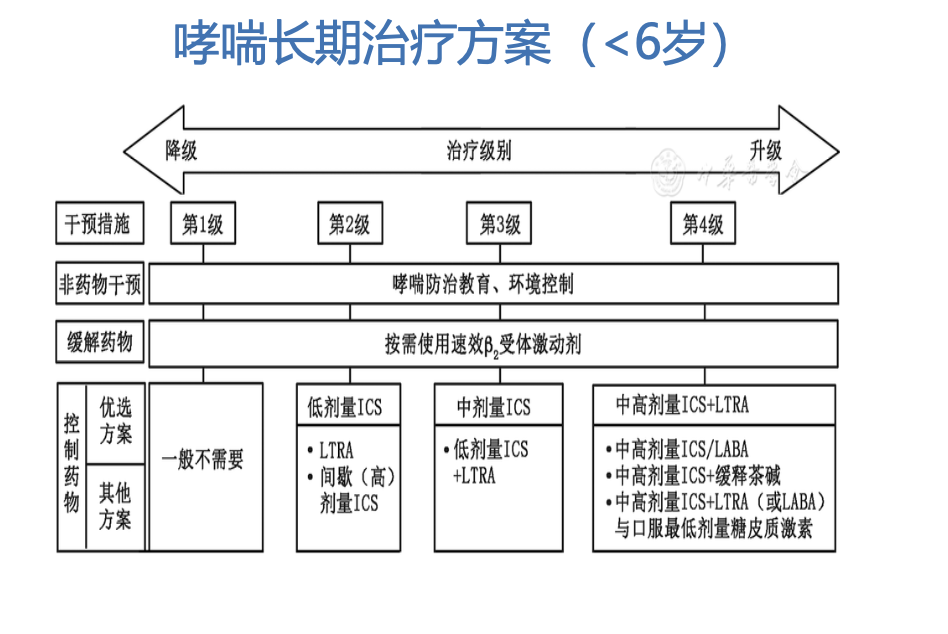
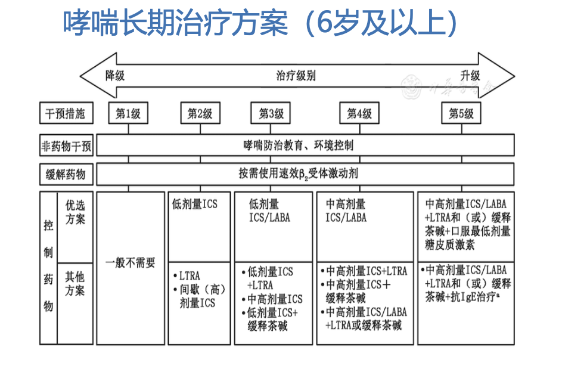

# 呼吸系统疾病

## 第一节 | 儿童呼吸系统解剖、 生理和免疫特点

#### 解剖特点

- 呼吸系统以**环状软骨下缘**为界分为上、下呼吸道
	- 上呼吸道：鼻、鼻窦、咽、咽鼓管、会厌及喉
	- 下呼吸道：气管、支气管、毛细支气管、呼吸性支气管、肺泡管、肺泡
- ==上呼吸道==
	- 鼻：儿童期鼻腔相对短小，鼻道狭窄
	- 鼻窦：各鼻窦发育时间不同。上颌窦和筛窦2岁逐渐增大，12岁充分发育；额窦2岁；蝶窦4岁
	- 咽鼓管：短、宽、直，呈水平位，<u>鼻咽炎易致中耳炎</u>
	- 咽：咽部较狭窄且垂直
	- 扁桃体：
		- 腭扁桃体，1岁末增大，4～10岁达高峰，14~15岁逐渐退化
		- 咽扁桃体：又称腺样体，6个月就已发育
	- 喉部：呈漏斗形，喉腔较窄，声门狭小，软骨柔软，粘膜柔嫩而富有血管及淋巴组织，易引起急性喉炎
- ==下呼吸道==
	- 气管、支气管较成人狭窄，软骨柔软，管腔弹性组织发育差，气道黏膜柔嫩，血
		管丰富，纤毛功能相对较弱，易发生气道阻塞症状。
	- 左支气管细长，右支气管短粗，似气管直接延伸，异物较易坠入右支气管。
	- 肺：数量少且面积小，弹力组织发育较差，血管丰富，间质发育旺盛，肺含血量
		多而含气量少。
- ==胸廓==
	- 婴幼儿胸廓较短，前后径相对较长，呈<u>桶状胸</u>;
	- 肋骨呈水平位，膈肌位置较高，胸廓小而肺脏相对较大；
	- 呼吸肌发育差;
	- 小儿纵膈体积相对较大，周围组织松软，在胸腔积液或气胸时易致纵隔移位。

#### 生理特点

- 呼吸频率、节律与呼吸类型

	- 年龄越小，呼吸频率越快

	- 婴幼儿为腹式呼吸，呼吸肌易疲劳；学龄儿童则为胸腹式呼吸（混合式呼吸）

- 肺活量：50～70ml/kg

- 潮气量：6～10ml/kg，年龄越小潮气量越小

- 每分钟通气量：与成人相近

- 气体弥散量：较成人小

- 气道阻力：大于成人，阻力随年龄增大递减

#### 免疫特点

## 第二节 | 儿童呼吸系统疾病检查方法

## 第三节 | 急性上呼吸道感染

- 俗称”感冒”，是小儿的最常见疾病，主要侵犯鼻、鼻咽和咽部。

- 病因：

	- 普遍感冒：90%以上原发病原为病毒，其中鼻病毒、冠状病毒占60%，此外有呼吸道合胞病毒、腺病毒、柯萨奇病毒、埃可病毒等；

	- 流行性感冒：流感病毒引起。

- 临床表现：

	- 局部症状：鼻塞、喷嚏、流涕、干咳、咽痛、皮疹

	- 全身症状：发热、头痛、全身不适、乏力、呕吐、腹痛、腹泻等

- 并发症：

	- 自鼻咽部蔓延至附近器官：急性结膜炎、中耳炎，鼻窦炎、颈淋巴结炎、咽后壁脓肿、扁桃体周围脓肿、喉炎、支管炎、肺炎等
	- 血液播散：败血症，皮下脓肿、脓胸、心包炎、腹膜炎、关节炎、骨髓炎、脑膜炎等
	- 变态反应：风湿热、肾小球肾炎、类风湿病等

- 实验室检查：

	- 血常规、CRP、降钙素原
	- 病原学检测：咽拭子培养、病毒分离、血清学检查、抗原检测等

- 诊断和鉴别诊断：

	- 根据临床表现一般不难诊断
	- 鉴别：急性传染病早期、急性阑尾炎、变应性鼻炎

- 治疗：

	- 一般治疗：休息，饮水，呼吸道隔离，预防并发症
	- 病因治疗：
		- 抗病毒药物：普通感冒无特异性抗病毒药物；流感可用抗流感药物
		- 抗生素：细菌性或病毒继发细菌感染者
	- 对症处理：高热、惊厥、鼻塞

#### 咽结膜热

- 病原体：**腺病毒3、7型**
- 好发季节：春夏季
- 临床表现：高热、咽痛、眼部刺痛，有时伴消化道症状
- 体征：咽部充血，可见白色块状分泌物，周边无红晕，易于剥离；眼结合膜炎，球结膜出血；淋巴结肿大
- 病程：1~2周

#### 疱疹性咽峡炎

- 病原体：柯萨奇病毒A组
- 好发季节：夏秋季
- 临床表现：高热、咽痛、流涎、厌食、呕吐
- 体征：咽部充血，咽腭弓、软腭、腭垂的粘膜上可见多个2—4mm大小灰白色的疱疹,周围有红晕，1~2日后破溃后形成小溃疡，疱疹也可发生于口腔的其他部位。
- 病程：1周左右

## 第四节 | 急性感染性喉炎

- 定义：喉部黏膜的急性弥漫性炎症

	- 以==犬吠样咳嗽、声嘶、喉鸣、吸气性呼吸困难==为临床特征。部分患者可同时累及气管或支气管，为急性喉气管支气管炎
	- 冬春季节多发，且多见于婴幼儿

- 症状：发热、犬吠样咳嗽、声嘶、吸气性喉鸣和吸气性凹陷，严重时可出现发绀、烦躁不安、面色苍白、心率加快

- 体征：咽部充血，喉部、声带有不同程度的充血、水肿

	|      | 喉梗阻分度                                                   |
	| ---- | ------------------------------------------------------------ |
	| I    | 活动后出现吸气性喉鸣和呼吸困难，肺呼吸音清晰，心率无变化     |
	| II   | 安静时亦出现喉鸣和吸气性呼吸困难，肺部听诊可闻喉传导音或管状呼吸音，心率增快 |
	| III  | 除上述喉梗阻症状外，有烦躁不安，口唇及指趾发绀，双眼圆睁，惊恐万状，多汗，肺部呼吸音明显降低，心音低钝，心率快 |
	| IV   | 渐显衰竭、呈昏睡状，由于无力呼吸，三凹征反而不明显，面色苍白发灰，肺部听诊呼吸音几乎消失，仅有气管传导音，心音钝弱，心律不齐 |

- 一般白天症状轻，夜间入睡后加重

- 治疗原则：

	- 一般治疗：保证充分休息与水分摄入，保持呼吸道通畅
	- 糖皮质激素：可雾化吸入糖皮质激素，Ⅱ度以上喉梗阻患儿应使用全身糖皮质激素治疗

	- 控制感染：无需常规使用抗菌药物，如考虑细菌感染，及时选用适当足量广谱抗生素
	- 对症治疗：缺氧者给予吸氧，痰多者可用祛痰剂，避免使用镇静剂
	- 气管插管：严重缺氧征象或有Ⅲ度及以上喉梗阻者，及时进行气管插管和机械通气，必要时气管切开

## 第五节 | 急性支气管炎

## 第六节 | 毛细支气管炎

- 定义：一种婴幼儿较常见的下呼吸道感染，常发生于2 岁以下小儿，**发病高峰年龄为**
	**2～6 个月**。国内认为是一种特殊类型的肺炎，称为喘憋性肺炎。
- 病因：
	- **呼吸道合胞病毒**
	- 副流感病毒、腺病毒、鼻病毒、人类偏肺病毒、博卡病毒、肺炎支原体
- 临床表现：
	- 本病特点：**咳嗽与喘憋**同时发生；
	- 突出表现：**喘息和肺部哮鸣音**；
	- 症状：下呼吸道梗阻症状，呼气相延长伴喘息，严重者可出现<u>呼气性呼吸困难</u>，表现为面色苍白、烦躁不安，口周和口唇发绀；
	- 体征：呼吸浅快、鼻翼扇动、吸气性凹陷，心率加快，肺部可及呼气相哮鸣音，喘憋缓解时可闻及中细湿啰音，叩诊可呈过清音，肝上界下移；
	- 高峰期：呼吸困难发生后的48～72h。
- 实验室检查：
	- 外周血检查：白细胞总数及分类正常
	- 血气分析：疾病严重时PaO2降低，PaCO2增高
	- 病原学检测：病毒抗原、病毒核酸检测、病毒分离。
	- 胸部X线：不同程度的肺充气过度或斑片状浸润影，局部肺不张，也可见到支气管周围炎及肺纹理增粗。
- 诊断：
	- 发病年龄：小婴儿
	- 典型临床表现：喘息、哮鸣音
- 鉴别诊断
	- 支气管哮喘
	- 肺结核
	- 其他疾病 如纵隔占位、心源性喘息、异物吸入及先天性气管支气管畸形等
- 治疗：<u>以对症和支持治疗为主</u>
	- 监测生命体征，保持呼吸道通畅，维持正常的血氧饱和度，维持水电解质酸碱平衡。
	- 病因治疗：不推荐常规抗病毒药物；仅在不排除细菌感染时选择合理的抗菌药物。
	- 控制喘息：不推荐常规应用全身糖皮质激素；选用糖皮质激素吸入治疗，可试用支气管舒张剂吸入治疗，尤其是当有过敏性疾病史时。
	- 密切关注病情变化，及时处理并发症。

## 第七节 | 肺 炎

- 定义：肺炎是指不同病原体或其他因素（如吸入羊水、油类或过敏反应）等所引起的
	肺部炎症。主要的特征<u>是发热、咳嗽、气促、呼吸困难和肺部固定中、细湿啰音</u>。

- 分类：

	- 解剖：大叶性肺炎、支气管肺炎、间质性肺炎
	- 病因：感染性肺炎（病毒、细菌、支原体、衣原体、原虫、真菌）；非感染性肺炎（吸入性、坠积性、过敏性等）
	- 病程：急性<1个月、迁延性1～3个月、慢性\>3个月
	- 病情：
		- 轻症肺炎--以呼吸系统为主
		- **重症肺炎**—除呼吸系统出现呼吸衰竭外，**其他系统（循环、神经及消化系统等）亦受累**，全身中毒症状明显，可有酸碱失衡、水电解质紊乱，甚至危及生命
	- 感染地点：
		- 社区获得性肺炎（CAP) **院外或住院48h内**
		- 院内获得性肺炎（HAP) **住院48h后或出院48h后发生**

	- 病原学：

		|          |                                                      |                                                             |
		| -------- | ---------------------------------------------------- | ----------------------------------------------------------- |
		| 细菌     | 肺炎球菌 流感嗜血杆菌 (Hib) 金黄色葡萄球菌           | 大肠杆菌，链球菌 卡他莫拉氏菌 肺炎克雷伯杆菌 铜绿色假单胞菌 |
		| 病毒     | 呼吸道合胞病毒 ( RSV) 腺病毒(Ad) 流感病毒 副流感病毒 | 麻疹病毒 巨细胞病毒                                         |
		| 非典型菌 | 肺炎支原体(MP) 沙眼衣原体(CT) 肺炎衣原体(CP)         | 嗜肺军团菌 解脲支原体                                       |
		| 其它     |                                                      | 分枝杆菌 立克次体 卡氏肺囊肿 真菌                           |

- 病理生理

- 临床表现

	- 症状：发热，咳嗽，气促、呼吸困难，全身症状（精神萎靡、意识障碍、烦燥不安，食欲减退、呕吐、腹泻……）
	- 体征：呼吸增快 （R40~80次/分、鼻翼扇动、三凹征)；发绀；肺部啰音：<u>固定中、细湿啰音</u>

- 实验室检查

	- 外周血检查：白细胞检查、C-反应蛋白、前降钙素
	- 病原学检测：细菌、病毒、支原体、其他
	- 血气分析
	- 胸部X线检查

	- 细菌学检查

		- 方法：
			- 涂片染色和培养
			- 其他：血清学、荧光多重PCR
		- 标本：
			- **血或胸水、脓液**
			- **痰或鼻咽深部吸出物**
			- **咽拭子**
			- 肺穿刺
			- 气管吸出物或肺泡灌洗液

	- 病毒学检查

		| 标本                | 方法                                        |
		| ------------------- | ------------------------------------------- |
		| NPA或痰、肺泡灌洗液 | 病毒分离                                    |
		| 双份血清            | 特异性IgG抗体测定**（IgG滴度升高4倍以上）** |
		| NPA或痰、肺泡灌洗液 | **病毒抗原检测**（ELISA、IFA、RIA等）       |
		| *NPA：鼻咽吸出物*   | **病毒核酸测定**（PCR、核酸分子杂交）       |
		| 血                  | 血特异性IgM抗体                             |

	- 胸部X线检查：
		- 早期表现：肺纹理增多、模糊，透亮度降低
		- **典型改变：斑点状或斑片状阴影**
		- 其他表现：肺气肿、肺不张、肺实变、脓胸、脓气胸、肺大泡

- 诊断：

	- **典型临床表现**：发热；咳嗽；呼吸急促；肺部固定中、细湿啰音
	- **胸部X线确诊**
	- 确诊后评估病情和明确引起肺炎的病原体

- 鉴别诊断：

	1. **急性支气管炎**：咳嗽为主要症状；一般无呼吸困难；湿啰音粗大、多变；婴儿难与肺炎鉴别；胸片诊断可靠
	2. **支气管异物**：异物吸入史与立即呛咳史；相对平稳期后出现反复咳喘和肺部感染；<u>X线检查： 阳性阴影、支气管阻塞征（肺不张或肺气肿）、纵隔摆动</u>
	3. 支气管哮喘【**咳嗽变异型哮喘**】：反复咳嗽病史、抗感染治疗无效；常具有过敏体质；常有过敏性疾病家族史；胸片、肺功能检查有助鉴别
	4. **肺结核**：结核接触史、卡介苗接种史；一般无肺部湿啰音；结核菌素试验常阳性；胸片改变；治疗反应

- 并发症

	- 急性期：
		1. 肺不张
		2. 肺气肿
		3. ==脓胸==
			- 高热不退；呼吸困难加重；患侧呼吸运动减弱；患侧触觉语颤减弱或消失；听诊患侧呼吸音减弱或消失；叩诊浊音；患侧肋间隙饱满，纵膈、气管向健侧移位；
			- 胸片和胸穿可确诊。胸片：左肋膈角变钝；左下密度增高影， 呈反抛物线状
		4. ==脓气胸==
			- 剧烈咳嗽、烦躁不安；面色发绀、呼吸困难加重；患侧呼吸运动减弱；患侧触觉语颤减弱或消失；听诊患侧呼吸音减弱或消失；叩诊浊音上方呈鼓音
			- 胸片和胸穿可确诊。立位胸部X片见液气平面
		5. ==肺大泡==：体积小者无症状；体积大者可引起呼吸困难。X线见薄壁空洞
	- 远期：
		- 支气管扩张（腺病毒感染）
		- 闭塞性细支气管炎（腺病毒、麻疹病毒、支原体感染）
		- 喘息性疾病（RSV病毒感染）

- 治疗：**采用综合治疗，原则为改善通气、控制感染、对症治疗、防止和治疗并发症**

	- 对症治疗及护理
	- 抗感染治疗
	- 呼吸支持
	- 并发症的治疗
	- 其他：糖皮质激素、生物制剂IVIG、纤维支气管镜

---

#### 不同病原所致肺炎

==腺病毒肺炎==

- 临床特征：高峰年龄*6m-1y*；起病急，**持续高热**；早期出现严重**中毒**症状，常伴有**嗜睡**等；剧烈咳嗽、喘憋；消化系统、神经系统症状；**肺部湿啰音出现较迟**、肝脾肿大、麻疹样皮疹等
- 并发症：
	- 急性期：心力衰竭、中毒性脑病、胸膜炎、继发细菌感染
	- 远期：支气管扩张、闭塞性细支气管炎、慢性阻塞性肺部疾病
- 辅助检查：
	- 非特异性检查：WBC正常/偏低，淋巴为主
	- 血气分析：低氧血肿、高碳酸血症、酸中毒
	- 特异性检查：Adv Ag(+),Adv-DNA(+) Adv-IgM(+)
	- X线特点：早期两肺纹理增多，病程3~7天出现片状融合，进一步进展可表现为大片实变。

==金黄色葡萄球菌肺炎==

- 临床特征：婴儿与新生儿多见；**起病急、发展快、病情重**；高热、**中毒症状**、剧烈咳嗽；可有腹泻、猩红热样皮疹；肺部**体征**出现早，**两肺散在中细湿啰音**
- 并发症：
	- 肺脓肿、脓胸、脓气胸
	- 肺大泡与气漏：气胸、纵隔气肿和皮下气肿
	- 转移性化脓性病变：化脓性心包炎、化脓性关节炎、软组织脓肿
- 辅助检查：
	- 非特异性检查：血WBC、CRP明显升高，中性为主
	- 血气分析：低氧血症、高碳酸血症、酸中毒
	- 特异性检查：血、胸水培养阳性
	- 胸片：**发展迅速+多种并发症+吸收缓慢**

==MP肺炎==

- 临床特征：学龄前及学龄儿童多发，婴幼儿也不少见；渐起发热、咽痛和咳嗽；以**持续高热**（1-3周）和**刺激性干咳**为特点；年长儿常**缺乏肺部体征**（湿啰音）；婴幼儿可表现严重呼吸困难与喘憋；β-内酰胺类无效，大环内酯类有效

- 并发症：
	- 多系统损害：心肌炎、心包炎、肝炎、胰腺炎, 多形性红斑 、 Stevens-Johnson 综合征、脑膜脑炎、神经根炎、溶血性贫血等
	- 可同时起病，或直接以肺外表现起病
	- **难治性肺炎支原体肺炎**
- 辅助检查：
	- 非特异性检查：WBC常正常，以中性为主，CRP可正常或稍升高
	- 特异性检查：MP Ag（+）MP-DNA（+）、RNA（+）MP-IgM（+）
	- 胸片多样化：支气管肺炎/间质性肺炎/大叶性肺炎/肺门阴影增浓

==沙眼衣原体肺炎==

- 主要通过**母婴垂直传播**而感染
- 主要见于婴儿，多为**1-3个月婴儿**
- 起病缓慢，**多无发热**，初为上感症状，**1/2有结膜炎**
- 呼吸增快和阵发性不连贯咳嗽
- 肺部偶及干湿啰音和哮鸣音
- X线示双侧间质性或小片状浸润，双肺过度通气

| 临床特征     | 轻症CAP      | 重症CAP                                                      |
| ------------ | ------------ | ------------------------------------------------------------ |
| 一般情况     | 好           | 差                                                           |
| 发热         | 未达重症标准 | 超高热，持续高热≥5d                                          |
| 拒食或脱水征 | 无           | 有                                                           |
| 意识障碍     | 无           | 有                                                           |
| 低氧血症     | 无           | 呼吸增快，辅助呼吸、间歇性呼吸暂停，氧饱和度<92%             |
| 胸片或胸部CT | 未达重症标准 | 多肺叶受累或≥2/3一侧肺浸润、胸腔积液、气胸、肺不张、肺坏死、肺脓肿 |
| 肺部并发症   | 无           | 有                                                           |
| 判断标准     |              | 存在以上**任意一项**                                         |

*呼吸增快*：婴儿≥70次/分，年长儿≥50次/分

---

#### 病原治疗

- 针对病菌选择：
  - 肺炎链球菌：青霉素G、头孢噻肟，头孢曲松
  - 金黄色葡萄球菌：苯唑西林、万古霉素
  - 流感嗜血杆菌：氨卞西林、复合β-内酰胺类、头孢菌素
  - 衣原体/支原体：大环内酯类
- 抗生素疗程：
	- 一般用至体温正常、全身症状明显改善、呼吸道症状部分改善后3～5天；
	- 肺炎链球菌感染7～10天
	- 衣原体或支原体感染平均10～14天，个别严重者适当延长；
	- 金黄色葡萄球菌肺炎应用至体温正常后维持2~3周，总疗程≥6 周。
- 病毒性肺炎：
	- RSV：病毒唑、IVIG、RSV单克隆抗体
	- **流感病毒 A & B：奥司他韦**
	- CMV：更昔洛韦
	- 其它：α 干扰素、IVIG
	- <u>原则上不用抗生素</u>

---

#### 呼吸支持

- 气道管理：保持气道通畅、肺部物理治疗（吸痰、叩打、震动等）、湿化、雾化吸入给药、气管插管
- 氧疗
- 辅助通气
- 体外膜氧合

---

#### 并发症治疗

- 合并心力衰竭：吸氧、镇静，**强心，利尿，扩血管**
- 对并存佝偻病、营养不良者，应给予相应治疗。
- 并发脓胸、脓气胸应及时胸腔闭式引流。
- 对痰液堵塞合并肺不张、内科治疗无效，尤其是塑形性支气管炎者可考虑进行可曲式支气管镜下灌洗治疗。

#### 其他治疗

- 激素应用指征：
	- 严重喘憋或呼吸衰竭
	- 全身中毒症状明显
	- 合并感染中毒性休克
	- 出现脑水肿
	- 胸腔短期有大量渗出

## 第八节 | 支气管哮喘

- 定义：

	- 支气管哮喘是**儿童期最常见的慢性**呼吸道疾病。
	- 由多种细胞（如嗜酸性粒细胞、肥大细胞、T淋巴细胞、中性粒细胞等及气道上皮细胞等）和细胞组分共同参与的**气道慢性炎症性**疾病。
	- 这种慢性炎症导致**气道高反应性**，当接触物理、化学、生物等刺激因素时，发生广泛多变的**可逆性气流受限**，从而引起**反复发作的喘息、咳嗽、气促、胸闷**等症状，常在夜间和（或）清晨发作或加剧，多数患儿可经治疗缓解或自行缓解。

- 病理生理变化：

	- 平滑肌收缩
	- 上皮脱落，受损；炎症、水肿；粘液，血浆渗出

- 临床表现：

	- 症状：
		- 典型：喘息、咳嗽、气促、胸闷
		- 重症：端坐呼吸、恐惧不安、大汗淋漓、面色青灰
	- 体征：
		- 呼气性呼吸困难：呼气时间延长、哮鸣音
		- 可伴有三凹征、桶状胸、肺部湿啰音
	- 临床特征：诱因多样性、反复发作性、时间节律性、季节性、可逆性
	- ==严重发作==
		- **哮喘危重状态（持续状态，Status asthmatics)**：哮喘急性发作在合理使用支气管舒张剂和糖皮质激素等哮喘缓解药物治疗后，仍有严重或进行性呼吸困难者。
		- **Silent lung（沉默肺，闭锁肺）**：气道广泛堵塞，哮鸣音消失，病情危重，是哮喘最危重的体征。

- 诊断标准：

	- **反复发作**喘息、咳嗽、气促、胸闷，多与接触变应原、冷空气、物理、化学性刺激、呼吸道感染以及运动等有关，常在夜间和（或）清晨发作或加剧。
	- 发作时在双肺可闻及散在或弥漫性**，以呼气相为主的哮鸣音，呼气相延长**。
	- 上述症状和体征经**抗哮喘治疗有效或自行缓解**。
	- **除外**其他疾病所引起的喘息、咳嗽、气促和胸闷。
	- <u>临床表现不典型者（如无明显喘息或哮鸣音），应至少具备以下1项：</u>
		- 证实存在**可逆性气流受限**：
			- ①支气管舒张试验阳性：吸入速效2受体激动剂（如沙丁胺醇压力定量气雾剂200~400µg）后15分钟第一秒用力呼气量（FEV1）增加≥12%；
			- ②抗炎治疗后肺通气功能改善：给予吸入糖皮质激素和（或）抗白三烯治疗4~8周，FEV1增加≥12%；
		- **支气管激发试验阳性**；
		- **呼气峰流量（PEF）日间变异率（连续监测2周）≥13%**。

- 咳嗽变异性哮喘的诊断

	- 咳嗽持续>4周，常在夜间和（或）清晨发作或加重，以干咳为主；
	- 临床上无感染征象，或经较长时间抗生素治疗无效；
	- **抗哮喘药物诊断性治疗有效；**
	- 排除其他原因引起的慢性咳嗽；
	- 支气管激发试验阳性和（或）PEF每日变异率（连续监测2周）≥13%；
	- 个人或一、二级亲属特应性疾病史，或变应原检测阳性。
	- *以上1~4项为诊断基本条件*

- <6岁儿童哮喘的诊断

	- **哮喘预测指数**，适用于过去1年喘息≥4 次的3 岁内幼儿，具有1项主要危险因素或2 项次要危险因素即为阳性。
		- 主要危险因素包括：①父母有哮喘病史；②经医生诊断为特应性皮炎；③有吸入变应原致敏的依据。
		- 次要危险因素包括：①有食物变应原致敏的依据；②外周血嗜酸性粒细胞≥4%；③与感冒无关的喘息。

- 诊断和病情评估相关检查

	1. **肺通气功能检测**：是诊断哮喘的重要手段，也是评估哮喘病情严重程度和控制水平的重要依据。

		- 主要表现为阻塞性通气功能障碍，且为可逆性；

		- 多数患者，尤其在哮喘发作期间或有临床症状或体征时，常出现**FEV1（ 正 常 ≥80%预计值）和FEV1/FVC（正常≥80%）**等参数的降低。

		- 支气管激发试验阳性、支气管舒张试验阳性或**PEF每日变异率≥13%**均有助于确诊哮喘。

	2. **胸部影像学检查**：
		- 哮喘诊断评估时，在没有相关临床指征的情况下，不建议进行常规胸部影像学检查。
		- 反复喘息或咳嗽儿童，怀疑哮喘以外其他疾病，如气道异物、结构性异常（如血管环、先天性气道狭窄等）、慢性感染（如结核）以及其它有影像学检查指征的疾病时，选择进行。
	3. **过敏状态检测**：推荐进行变应原皮肤点刺试验或血清变应原特异性IgE测定。
		- 了解患者的过敏状态，协助哮喘诊断；有助于制定环境干预措施；确定变应原特异性免疫治疗方案
		- 外周血嗜酸性粒细胞分类计数对过敏状态的评估有一定价值。
		- 过敏状态检测阴性不能作为排除哮喘诊断的依据。
	4. **支气管镜检查**：反复喘息或咳嗽儿童，抗哮喘治疗无效，怀疑其他疾病或哮喘合并其它他疾病，如气道异物、气道局灶性病变（如气道内膜结核、气道内肿物等）和先天性结构异常（如先天性气道狭窄、食管-气管瘘）等时，应予以支气管镜检查以进一步明确诊断。
	5. **气道无创炎症指标检测**：
		- 痰或诱导痰中嗜酸粒细胞、呼出气一氧化氮(FeNO)水平等；
		- 虽然目前尚无前瞻性研究证实诱导痰嗜酸粒细胞分类计数和FeNO等无创气道炎症指标在儿童哮喘诊断中的确切价值，但这些指标的连续监测有助于评估哮喘的控制水平和指导优化哮喘治疗方案的制定。

- 哮喘的鉴别诊断

	- <u>并非所有的喘息患儿都是哮喘？</u>对首次哮喘样发作或常规平喘无效者应注意排除其它疾病，尤其需注意异物吸入、气道结构异常…
	- <u>并非所有的哮喘患儿都有喘息？</u>咳嗽变异型哮喘；胸闷变异型哮喘
	- ==喘息的异质性wheezing==--气道梗阻原因的多样化
		- 腔内因素：异物、痰栓、血块、肿瘤等腔内异物（吸入性或内生性）
		- 管壁增厚：炎症性充血、水肿或肥厚
		- 管壁内陷：功能性（痉挛收缩或软化塌陷）或结构性狭窄（先天性或继发性）
		- 腔外受压：肿块、大血管、淋巴结等压迫

- 分期：

	- <u>急性发作期</u>：突然发生喘息、咳嗽、气促、胸闷等症状，或原有症状急剧加重
	- 非急性发作期（维持期）
		- <u>慢性持续期</u>：近3个月内不同频度和/或不同程度地出现过喘息、咳嗽、气促、胸闷等症状
		- <u>临床缓解期</u>：经过治疗或未经治疗症状、体征消失，肺功能恢复到急性发作前水平，并维持3个月以上

- 治疗目标：

	- 有效控制急性发作症状，并维持最轻的症状，甚至无症状；
	- 防止症状加重或反复；
	- 尽可能将肺功能维持在正常或接近正常水平；
	- 防止发生不可逆的气流受限；
	- 保持正常活动（包括运动）能力；
	- 避免药物不良反应；
	- 防止因哮喘而死亡。

- 治疗原则：

	- 哮喘控制治疗应越早越好；
	- 要坚持**长期、持续、规范、个体化**治疗原则；
	- *急性发作期*：快速缓解症状，如平喘、抗炎治疗；
	- *慢性持续期和临床缓解期*：坚持长期抗炎，降低气道反应性，防止气道重塑，避免危险因素和自我保健。

- ==哮喘治疗主要药物==

	| 快速缓解药物               | 长期控制药物            | 重度哮喘附加治疗药物 （生物靶向药物） |
	| -------------------------- | ----------------------- | ------------------------------------------ |
	| ==速效吸入型β2受体激动剂== | ==吸入型糖皮质激素ICS== | 抗IgE单克隆抗体                            |
	| 抗胆碱能药物               | 白三烯受体调节剂LTRA    | 抗IL-5单克隆抗体                           |
	| 短效口服β2受体激动剂       | 长效β2受体激动剂        | ……                                         |
	| 短效茶碱                   | 长效抗胆碱能药物        |                                            |
	| 全身性皮质激素             | 缓释茶碱                |                                            |
	|                            | 色甘酸钠                |                                            |
	|                            | 全身性糖皮质激素        |                                            |

- 防治原则
	- 强调基于症状控制的哮喘管理模式，治疗过程中遵循“评估-调整治疗-监测”的管理循环，直至停药观察。
	- 
- <u>哮喘临床指标改善的时间早于气道反应性恢复的时间。</u>
	- 在ICS治疗期间，相关哮喘控制指标改善所需时间是不同的。**夜间症状首先得到改善，随之为FEV1、清晨PEF，然后是缓解药物的使用，AHR改善所需时间最长。**AHR是一个气道炎症指标 。
	- 因此，临床症状的改善不代表哮喘治愈，不能作为停药的指征，ICS需长期维持治疗，才能有效控制哮喘气道炎症。
- 哮喘急性发作的治疗
	- 家庭治疗：及时使用吸入性速效ß2受体激动剂pMDI+3喷或雾化吸入方法给药；如治疗后喘息症状未能有效缓解或症状缓解维持时间短于4小时，即刻就医。
	- 医院治疗：
		- **氧疗 ： 鼻导管或面罩吸氧使SPO2>0.94**
		- 吸入速效β2受体激动剂
		- 糖皮质激素
		- 抗胆碱药
		- 硫酸镁
		- 茶碱
		- 辅助机械通气治疗

---

#### 药物

1. ==吸入速效β2受体激动剂==：**治疗儿童哮喘急性发作的一线药物**。

	- 首选高剂量、短间隔雾化吸入SABA
		- 高剂量：沙丁胺醇或特布他林：体重≤20kg，2.5mg/次；体重>20kg，5mg/次
		- 短间隔：第1小时可每20分钟1次，根据治疗反应延长
	- 定量气雾剂（MDI）+储雾罐（SPACER）
		- <6岁，3～6Puff/次
		- ≥6岁，4～10Puff/次
	- 快速起效的LABA（如福莫特罗）也可在6岁及以上哮喘儿童作为缓解药物使用，但需要和ICS联合使用。

2. ==糖皮质激素==：**全身应用糖皮质激素是治疗儿童哮喘重度发作的一线药物。**

	- 口服：泼尼松龙或泼尼松1~2mg/kg/d，疗程3~5d；

	- 静滴：
		- 甲基强的松龙 1～2mg/kg/次
		- 琥珀酸氢化可的松 5～10mg/kg/次
		- 根据病情可间隔4~8小时重复使用
	- 雾化吸入：
		- 布地奈德悬液1mg/次，或丙酸倍氯米松混悬液0.8mg/次
		- 每6-8小时1次。

3. ==抗胆碱药==：

	- 异丙托溴铵，SAMA：**哮喘急性发作联合治疗的组成部分，尤其对于β2受体激动剂治疗反应欠佳的中重度尽早联合使用**。
		- 体重≤20kg，250μg/次
		- 体重>20kg，500 μg/次
		- 加入β2受体激动剂溶液作雾化吸入，间隔时间同吸入β2受体激动剂。

4. ==硫酸镁==（二线用药）：**有助于危重哮喘症状的缓解**

	- 25-40mg/kg•d（≤2g/d），分1～2次，加入10%葡萄糖溶液20ml缓慢静脉滴注(20min以上)；酌情使用1~3天；
	- 不良反应包括一过性面色潮红、恶心等，通常在药物输注时发生，如过量可**静注10%葡萄糖酸钙拮抗**。

5. ==氨茶碱==：**一般不推荐**。如前述药物无效，可考虑使用，注意速度和剂量，需监测心电图、血药浓度。

	- 负荷量4-6mg/kg（≤250mg），20-30分钟内缓慢静滴，0.7~1.0mg/kg/h维持；或4-6mg/kg /次，Q6-8h。
	- 已用口服氨茶碱者，直接使用维持剂量持续静脉滴注。

6. ==机械通气==

	- 经合理联合治疗，但症状持续加重，出现呼吸衰竭征象时，应及时给予辅助机械通气治疗。
	- 在应用辅助机械通气治疗前禁用除以水合氯醛以外的镇静剂。

## 第九节 | 支气管扩张症

> [!IMPORTANT] 
>
>  两种特殊类型的上感的临床表现
>
>  急性喉炎的临床表现和治疗原则
>
>  毛细支气管炎的临床表现和诊断
>
>  儿童支气管哮喘、咳嗽变异型哮喘的诊断标准
>
>  儿童支气管哮喘的急性发作期、慢性持续期及临床缓解期的治疗原则
>
>  儿童支气管哮喘的急性发作期的处理
>
>  肺炎的定义、分类、肺炎的临床表现（并发症）、实验室检查及诊断
>
>  肺炎的治疗原则、抗生素应用原则
>
>  不同类型肺炎的特点

