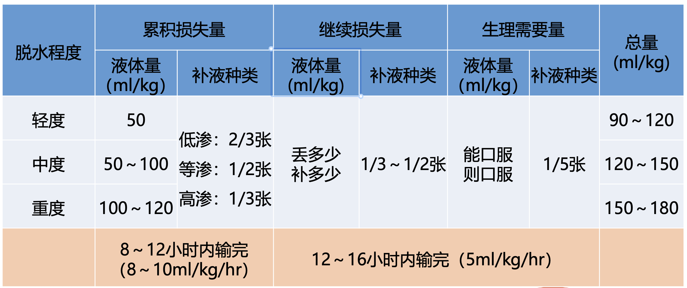
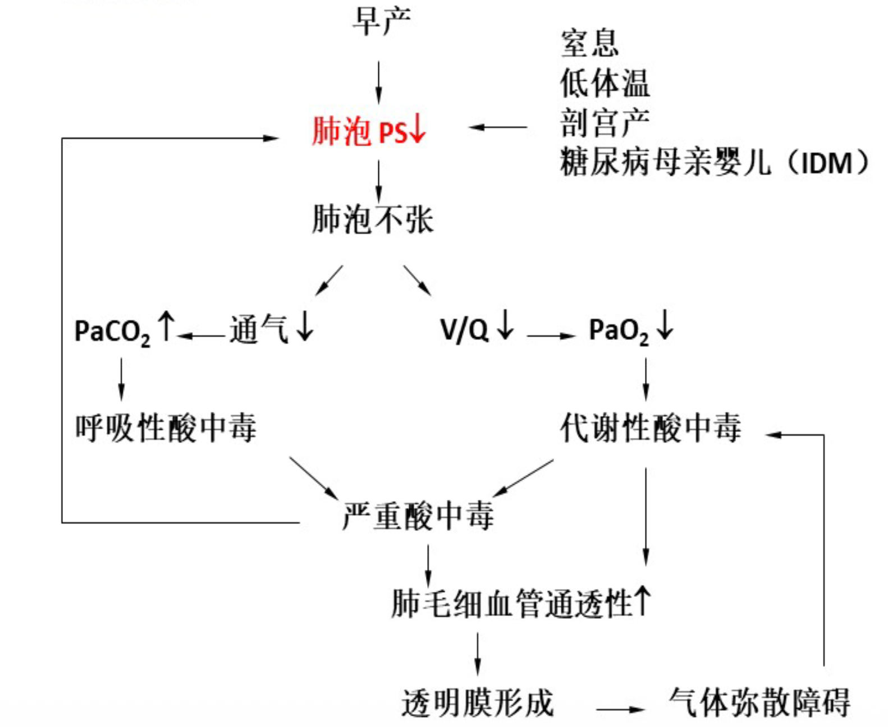
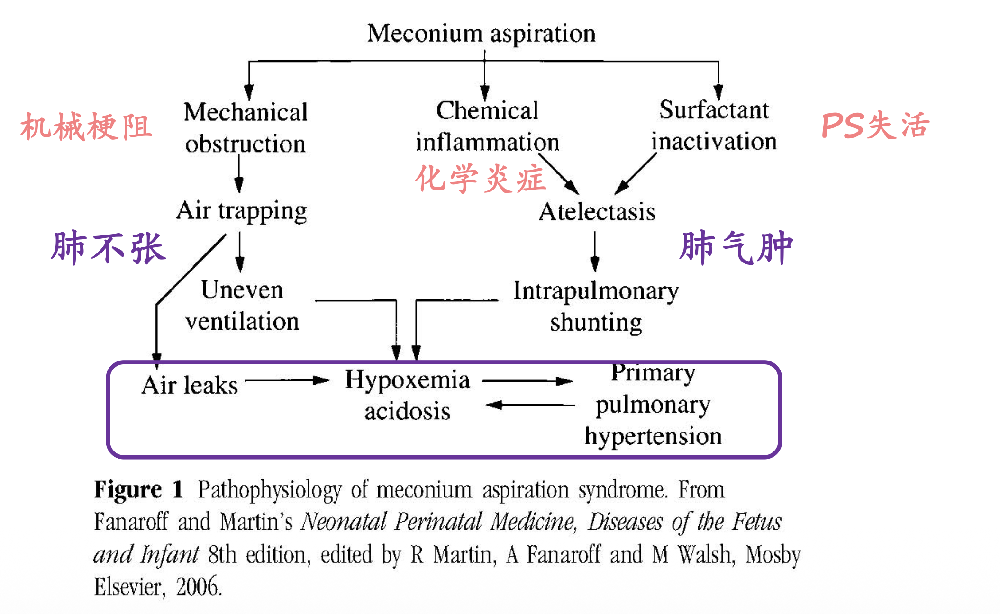
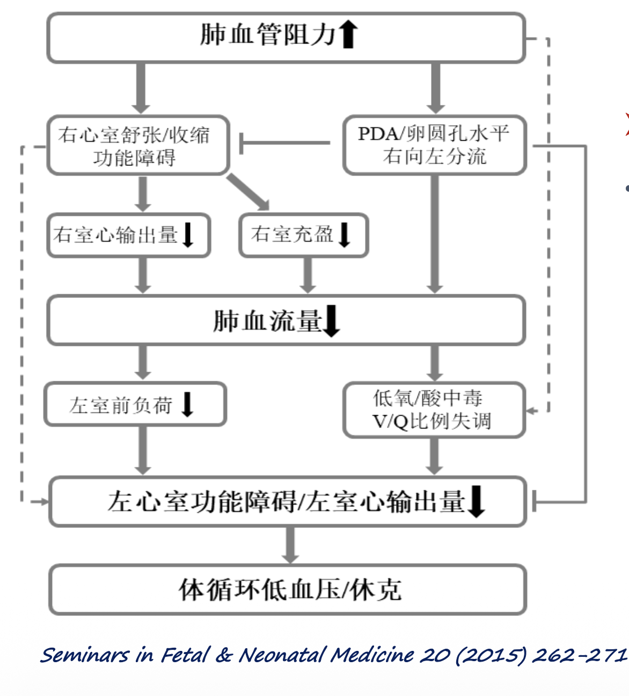
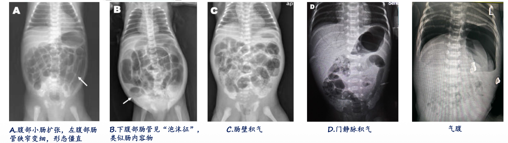

[TOC]

## 液体疗法

| 症状和体征 | 轻度   | 中度           | 重度           |
| ---------- | ------ | -------------- | -------------- |
| 心率增快   | 无     | 有             | 有             |
| 脉搏强度   | 可触及 | 可触及（减弱） | 明显减弱       |
| 血压       | 正常   | 体位性低血压   | 低血压         |
| 皮肤灌注   | 正常   | 正常           | 减少，出现花纹 |
| 皮肤弹性   | 正常   | 轻度降低       | 降低           |
| 前囟       | 正常   | 轻度凹陷       | 凹陷           |
| 黏膜       | 湿润   | 干燥           | 非常干燥       |
| 眼泪       | 有     | 有或无         | 无             |
| 呼吸       | 正常   | 深，也可快     | 深快           |
| 尿量       | 正常   | 少尿           | 无尿或严重少尿 |

> 轻度：3-5%体重减少/30-50ml/kg体液丢失
>
> 中度：5-10%体重减少/50-100ml/kg体液丢失
>
> 重度：≥10%体重减少/100-120ml/kg体液丢失

| 脱水性质   | 血清钠水平    | 主要受影响部位 | 主要症状                                                  |
| ---------- | ------------- | -------------- | --------------------------------------------------------- |
| 低渗性脱水 | <130mmol/L    | 细胞外         | 脱水症状较重，较早发生休克，循环障 碍更突出，脑水肿，脑疝 |
| 等渗性脱水 | 130-150mmol/L | 细胞外         | 水和电解质成比例丢失，主要是细胞外 液丢失                 |
| 高渗性脱水 | >150mmol/L    | 细胞内         | 烦渴、高热、烦躁不安等，脱水较轻， 循环障碍不明显         |

| 液体名称  | 生理盐水 | 10%GS | 1.4% NaHCO~3~ | Na^+^:Cl^-^ | 液体张力 |
| --------- | -------- | ----- | ------------- | ----------- | -------- |
| 2:1等张液 | 2        |       | 1             | 3:2         | 1        |
| 4:3:2液   | 4        | 3     | 2             | 3:2         | 2/3      |
| 2:3:1液   | 2        | 3     | 1             | 3:2         | 1/2      |
| 1:4液     | 1        | 4     |               | 1:1         | 1/5      |
| 1:1液     | 1        | 1     |               | 1:1         | 1/2      |

==液体疗法=生理需要量+累积损失量+继续丢失量==

> 补液步骤：“三定”－定量、定性、定速
>
> 补液原则：“三先”－先浓后淡、先盐后糖、先快后慢
>
> “两补”－见尿补钾、见惊补钙

1. 生理需要量：100/50/20法

  | 体重/kg | 液体量                           |
  | ------- | -------------------------------- |
  | 0-10    | 100ml/(kg·d)×体重数              |
  | 11-20   | 1000ml/d+(体重数-10)×50ml/(kg·d) |
  | >20     | 1500ml/d+(体重数-20)×20ml/(kg·d) |

2. 累积损失量：

	- 定量：
		- 轻度：30-50ml/kg体重
		- 中度：50-100ml/kg体重
		- 重度：100-120ml/kg体重
	- 定性：
		- 低渗性：2/3张含钠液
		- 等渗性：1/2张含钠液
		- 高渗性：1/3-1/5张含钠液
	- 速度：
		- 伴有循环不良和休克的重度脱水患儿：开始快速输入等张溶液（生理盐水或2:1等张液）按20ml/kg于0.5-1h内输入
		- 循环改善出现排尿后及时补钾
		- 高渗性脱水：缓慢纠正高钠血症

3. 继续丢失量：“丢多少补多少”

# 新生儿

| 足月儿                     | 早产儿            | 过期产儿          |
| -------------------------- | ----------------- | ----------------- |
| 37周≤GA＜42周（260-293天） | GA<37周（<259天） | GA≥42周（≥294天） |

> 出生胎龄GA：从最后1次正常月经第1天起至分娩时止，通常以周表示
>
> | 超早产儿 | 极早产儿 | 中度早产儿 | 晚期早产儿   |
> | -------- | -------- | ---------- | ------------ |
> | GA<28周  | 28-32周  | 32-34周    | 34周≤GA<37周 |

| 正常出生体重儿 | 极低出生体重儿VLBW | 超低出生体重儿ELBW | 巨大儿   |
| -------------- | ------------------ | ------------------ | -------- |
| 2500g≤BW≤4000g | BW<1500g           | BW<1000g           | BW>4000g |

### 新生儿窒息

| 体征               | 0分        | 1分              | 2分          |
| ------------------ | ---------- | ---------------- | ------------ |
| 皮肤颜色           | 青紫或苍白 | 躯干红、四肢青紫 | 全身红       |
| 心率（次/分）      | 无         | ≤100             | >100         |
| 弹足底或插鼻管反应 | 无反应     | 有些动作，如皱眉 | 哭，喷嚏     |
| 肌张力             | 松弛       | 四肢略屈曲       | 四肢活动     |
| 呼吸               | 无         | 慢，不规则       | 正常，哭声响 |

> 1min评分：窒息严重程度；5min评分：复苏效果及判断预后
>
> 8-10分：正常；4-7分：轻度窒息；0-3分：重度窒息

### 新生儿缺血缺氧性脑病

- 胎龄≥35周新生儿因围产期窒息引起的部分或完全缺氧、脑血流减少或暂停而导致胎儿或新生儿脑损伤。

| 指标           | 轻度                    | 中度                        | 重度                                                      |
| -------------- | ----------------------- | --------------------------- | --------------------------------------------------------- |
| 意识           | 激惹                    | 嗜睡                        | 昏迷                                                      |
| 肌张力         | 正常                    | 减低                        | 松软                                                      |
| 拥抱反射       | 活跃                    | 减弱                        | 消失                                                      |
| 吸吮反射       | 正常                    | 减弱                        | 消失                                                      |
| 惊厥           | 可有肌阵挛              | 常有                        | 有，可呈持续状态                                          |
| 中枢性呼吸衰竭 | 无                      | 有                          | 明显                                                      |
| 瞳孔改变       | 扩大                    | 缩小                        | 不等大，对光反射迟钝                                      |
| EEG            | 正常                    | 低电压，可有痫样放电        | 爆发抑制，等电位                                          |
| 病程及预后     | 症状在72h内消失，预后好 | 病程14d内消失，可能有后遗症 | 数天-数周死亡，症状可持续数周，病死率高，存活者多有后遗症 |

### 新生儿呼吸窘迫综合征 RDS

- 为肺表面活性物质缺乏所致，以生后不久出现呼吸窘迫并进行性加重为特征的临床综合征
- 病因：早产、糖尿病母亲婴儿、择期剖宫产儿、其他

- 临床表现
	- <30 周早产儿，在产房即可出现RDS临床表现
	- 胎龄越大RDS表现越晚，>34 周早产RDS症状可在生后3-4小时才出现
	- RDS 主要表现
		- 发绀 Cyanosis
		- 气急 Tachypnea
		- 吸气性凹陷 Retractions
		- 呼气呻吟 Grunting
- 并发症：
	- ==HsPDA动脉导管未闭==：早产儿RDS在恢复期，可突然出现肺部症状加重，呼吸暂停、二氧化碳潴留增加，对氧的需求和呼吸机参数的要求增加，胸片肺部渗出明显增加呈肺水肿，严重者可表现为肺出血（长期暴露于肺循环负荷过多、改变肺血管的发育、导致肺血管阻力增加）
	- ==PPNH肺血管痉挛==：肺血管结构正常，但由于围产期窒息或肺实质疾病，例如MAS、RDS、肺炎和败血症等，<u>肺血管不能适应生</u>
		<u>后环境而始终处于收缩，肺动脉压力不能下降</u>，又称为肺血管适应不良
- 诊断：病史，临床表现，X线胸片，肺部超声
- X线胸片：
	- **毛玻璃样改变（ground glass）**：两肺呈普遍性透过度降低，可见弥漫性均匀一致的细颗粒（肺泡不张）网状影，见于RDS初期或轻型病例
	- **支气管充气征（air bronchogram）**：在弥漫性不张肺泡（白色）的背景下，充气的支气管（黑色）清晰显示，RDS中晚期或较重病例多见
	- **白肺（white lung）**：整个肺野呈白色，肺肝界及肺心界均消失，见于严重RDS
- 鉴别：
	1. 新生儿暂时性呼吸增快TTN/**湿肺**：自限性疾病；肺内液体吸收及清除延迟所致；足月儿、剖宫产儿
	2. B组链球菌肺炎
	3. 先天性膈疝
- 预防：
	- 产前：预防早产、产前激素
	- 产后：外源性表面活性物质替代、持续气道正压 CPAP

> [!IMPORTANT]
>
> 人群---早产儿为主
>
> 病因---肺表面活性物质缺乏
>
> 病理---肺泡委陷
>
> 防治---产前激素+生后早期PS

---

### 新生儿胎粪吸入综合征 MAS

- 胎儿在宫内或产时吸入混有胎粪的羊水导致；以**呼吸道机械性阻塞及肺组织化学性炎症**为病理特征

- 临床表现：
	- 常见于足月儿或过期产儿，多有宫内窘迫史和(或)出生窒息史；症状轻重与羊水的性质和量的多少相关
	- 吸入胎粪污染的羊水（诊断必备条件）
		1. 分娩时可见羊水胎粪污染
		2. 皮肤、脐带、指趾甲床留有胎粪
		3. 口鼻腔吸引物中含有胎粪
		4. 气管插管时声门处或气管内吸引物可见胎粪（即可确诊）
	- 呼吸系统
		- 生后呼吸窘迫(呼吸急促/青紫/鼻翼扇动/吸气性凹陷)
		- 12-24小时进展
		- 胸廓饱满似桶状胸
		- 肺部可闻及湿罗音，如呼吸音减弱，应注意气胸
	- 循环系统---PPHN

- 诊断：
	- 有明确的吸入胎粪污染的羊水病史(气管插管时声门处或气管内吸引物可见胎粪）
	- 生后出现呼吸窘迫
	- 胸部X线改变
	- 严重程度
		- 轻度：需要少于40%的氧气，新生儿小于48h
		- 中度：需要超过40%的氧气，新生儿超过48h，没有气漏综合症
		- 严重：新生儿需要辅助通气超过48h

- 预防：
	- 预防宫内窘迫/窒息：持续或定期监测产时胎儿心率(FHR) ，评估和干预措施实施的情况下，异常跟踪胎儿应激指示
	- 分娩胎龄：孕41周至孕42周考虑终止妊娠

- 治疗：
	- 维持充足的氧合和通气(脉搏血氧饱和度90-95%或PaO2 50-90 mmHg)
	- 维持适当的血压和灌注
	- 纠正任何代谢异常，包括低血糖和酸中毒
	- 经验性抗生素治疗
	- 在中性热环境中护理(除非有低氧缺氧性脑病的迹象，用低温治疗)
	- 尽量减少对患儿的刺激性处理，以避免躁动加剧新生儿持续性肺动脉高压(PPHN)

> [!IMPORTANT]
>
> 人群---足月儿尤其过期产儿
>
> 病因---吸入胎粪污染羊水
>
> 病理---气道阻塞/化学炎症
>
> 防治---宫内窒息/氧合通气、PS、PPHN

---

### 新生儿持续肺动脉高压PPHN

- 生后肺血管阻力持续性增高，肺动脉压超过体循环动脉压，由胎儿型循环过渡至正常“成人”型循环发生障碍，而引起的**心房及(或)动脉导管水平血液的右向左分流****,**临床上出现严重低氧血症等症状。**
- PPHN约占活产新生儿的**0.2%**，但在所有呼吸衰竭新生儿患儿中伴有不同程度的肺动脉高压的比例可高达**10%**，并有相对较高的死亡率。
- 病因：
	1. **肺血管痉挛**：肺血管结构正常，但由于围产期窒息或肺实质疾病，例如胎粪吸入综合征**(MAS)**、呼吸窘迫综合征**(RDS)**、肺炎和败血症等，导致肺血管不能适应生后的环境而始终处于收缩，肺动脉压力不能下降，又称为肺血管适应不良。
	2. **肺发育不全**：肺泡和肺血管发育均受到影响，最常见于先天性膈疝，少见于羊水过少综合征、肾发育不良**(Potter** 综合症**)**等。先天性膈疝是指膈肌异常发育，腹腔脏器疝入胸腔，从而导致不同程度的肺发育不全，正常模式的气道分支和肺泡化功能受损，肺动脉分支和肺血管床的横截面积减少，小动脉的中膜和外膜增厚。其死亡率约20～30%，取决于肺发育不全和PPHN的严重程度。
	3. **肺血管发育不良**：肺血管结构重塑、排列异常、肺小动脉异常肌化、肺毛细血管密度减少等，<u>常见于宫内慢性缺氧所致</u>，如小于胎龄儿、红细胞增多症。肺泡毛细血管发育不良**(ACD)**是一种罕见的肺间质性疾病，其特征是肺毛细血管数量减少，肺静脉分布排列异常。它在生后早期即可表现为严重的低氧血症和PPHN，病死率极高。此类疾病胸部检查无实质性疾病，透亮度不低，也称<u>“黑肺”PPHN</u>。
	4. 遗传因素：表面活性物质蛋白B基因缺失和ABCA3基因的突变引起严重呼吸窘迫综合征，可导致难治性PPHN。
	5. **心功能不全**：宫内动脉导管关闭引起血流动力学改变，生后出现肺动脉高压和右心衰竭；左心功能不全引起肺静脉淤血而继发肺动脉高压，临床处理针对改善心功能不全为主。
	6. **围产期药物**：孕母产前应用<u>非甾体类抗炎药</u>可导致胎儿宫内动脉导管关闭，引起血流动力学改变，生后易出现肺动脉高压和右心衰竭。孕20周后使用选择性5羟色胺再摄取抑制剂(SSRI)，会显著增加PPHN的风险。
- 病理生理：
	- 血流动力学变化：
		- **肺血管阻力升高，肺血流量减少，右心室功能障碍**(动脉导管或卵圆孔水平右向左分流)
		- **体循环低血压和休克**
- 诊断：
	- 临床表现（非特异性）：紫绀、呼吸窘迫、低氧血症（胸部X线片检查与严重的低氧血症不成比例）
	- 超声心动图检查：金标准；可直接或间接评估肺动脉压力

---

### 新生儿坏死性小肠结肠炎 NEC

- 新生儿坏死性小肠结肠炎（neonatal necrotizingenterocolitis，NEC）是一种<u>获得性的肠道炎症综合征</u>；涉及肠壁炎症和凝固性坏死，以**腹胀、呕吐和便血**为主要临床表现，以**肠壁囊样积气和门静脉积气**为主要X 线特征，是严重威胁新生儿生命的疾病之一。90% 的NEC 发生在早产儿，足月儿也可发生，<u>胎龄越小，NEC 的风险越大</u>。
- 病因：
	- 早产：NEC的独立高危因素。
	- 肠黏膜缺氧缺血
	- 感染
	- 肠道微生态环境失调
	- ……
- 病理：
	- 肠道病变轻重悬殊，轻者病变范围仅数厘米，重者甚至累及整个肠道
	- <u>最常受累的是回肠末端和近端结肠</u>
	- 肠腔充气，黏膜呈斑片状或大片坏死，肠壁有不同程度的积气、出血及坏死
	- 严重时整个肠壁全层坏死并伴肠穿孔
- 临床表现：
	- 多见于早产儿，发生时间和胎龄相关，胎龄越小，发病时间越晚。足月儿可在生后1 周内发病，而早产儿主要在生后2～3 周发病，平均在矫正胎龄30～32 周；极低出生体重儿可迟至2 个月。
	- 全身症状：无特异性，包括呼吸窘迫、呼吸暂停、嗜睡、体温波动、喂养不耐受等。严重患儿可出现出血、低血压、休克、惊厥、水和电解质代谢紊乱等。
	- 消化系统：本病的典型表现为<u>腹胀、呕吐和血便三联征</u>，多数初起表现为胃潴留增加、腹胀和呕吐等喂养不耐受的症状，随后出现大便性状改变、血便查体可见肠型、腹壁发红，部分患儿右下腹肌紧张、压痛，肠鸣音减弱或消失，重者发生腹膜炎和肠穿孔。
- 腹部影像学：对NEC诊断有重要意义，应拍摄正位和侧位片，开始每6～8h 随访一次，随后12～24h 随访一次，直到正常。
	- 非特异性表现：肠管扩张，肠壁增厚，腹腔积液
	- **特异性表现：肠壁积气、粘膜下“气泡征”、门静脉积气、气腹**

- 血常规：白细胞异常升高或降低，粒细胞总数、**血小板减少**

### 新生儿黄疸、新生儿溶血病【治疗】

1. 产前治疗
	1. 提前分娩
	2. 血浆置换
	3. 宫内输血
	4. 苯巴比妥
2. 新生儿期治疗
	1. 光照疗法
	2. 药物治疗：1)供给白蛋白 2)纠正代谢性酸中毒 3)肝酶诱导剂 4)静脉用免疫球蛋白
	3. 换血疗法（换出部分血中游离抗体和致敏红细胞减轻溶血；换出血中大量胆红素防止发生胆红素脑病；纠正贫血）
		- 指征

---

# 心血管系统

### 心力衰竭

- 临床表现：

	- 年长儿：与成人相似。乏力、食欲缺乏、活动后气急和咳嗽。安静时心率增快，呼吸浅快，颈静脉怒张，肝大、有压痛，肝经静脉回流试验阳性。听诊：除原有疾病产生的心脏杂音和异常心音外，常可听到 <u>心尖区第一心音减低和奔马律</u>
	- 婴幼儿：呼吸浅快（50-100bpm），喂养困难，体重增长缓慢，烦躁多汗，哭声低弱，肺部可闻及干啰音或哮鸣音。水肿首先见于颜面、眼睑等部，<u>严重时鼻唇三角区呈现青紫</u>。

- 诊断依据：

	1. 安静时心率增快：婴幼儿≥180次/分，幼儿≥160次/分
	2. 呼吸困难，青紫突然加重，安静时呼吸达60次/分以上
	3. 肝大，达肋下3cm以上
	4. 心音明显低钝或出现奔马律
	5. 突然烦躁不安，面色苍白或发灰
	6. 尿少，下肢水肿

	---

	1. NT-proBNP：重要的心力衰竭标志物
	2. 胸部X线：心影通常普遍性扩大，搏动减弱，肺纹理增多，肺门或其附近阴影增加，肺部淤血
	3. 心电图
	4. 超声心电图检查

---

### 先天性心脏病

| 左向右分流型（潜伏青紫型）                                   | 右向左分流型（青紫型）                 | 无分流型（无青紫型）                 |
| ------------------------------------------------------------ | -------------------------------------- | ------------------------------------ |
| ==室间隔缺损、房间隔缺损、动脉导管未闭==                     | ==法洛四联症==、大动脉转位、三尖瓣闭锁 | 肺动脉狭窄、主动脉瓣狭窄、主动脉缩窄 |
| 体循环压力>肺循环，不出现青紫；剧烈哭闹、屏气时右侧压力超过左侧-右向左分流-暂时性青紫 梗阻性肺动脉高压-==艾森门格综合征==-右向左分流青紫持续存在 | 右心大量静脉血流入体循环-持续性青紫    | 左右两侧或动静脉之间无异常通路或分流 |

|          | 房缺ASD                      | 室缺VSD                      | 动脉导管未闭PDA                          | 法洛四联症TOF/F4                                       |
| -------- | ---------------------------- | ---------------------------- | ---------------------------------------- | ------------------------------------------------------ |
| 主要杂音 | 胸骨左缘第2、3肋间收缩期杂音 | 胸骨左缘第3、4肋间收缩期杂音 | 胸骨左缘第2肋间连续性/机器样收缩期杂音   | 胸骨左缘第2-4肋间收缩期杂音                            |
| 杂音机制 | 相对性肺狭                   | 左向右分流                   | 左向右分流                               | 右室流出道梗阻                                         |
| 震颤     | 有                           | 有                           | 有                                       | **无**                                                 |
| P2       | 亢进                         | 亢进                         | 亢进                                     | **减弱**                                               |
| 其他杂音 | 三尖瓣区舒张期               | 心尖舒张期                   | 心尖舒张期                               | 侧支循环杂音                                           |
| 肺血     | 增多                         | 增多                         | 增多                                     | 减少                                                   |
| 房室增大 | 右房右室                     | 左室右室                     | 左房左室                                 | 右室                                                   |
| 肺动脉段 | 突出                         | 突出                         | 突出                                     | 缩小                                                   |
| 心影     | 梨形心                       |                              |                                          | 靴形心                                                 |
| 血氧含量 | 右房>腔静脉                  | 右室>右房                    | 肺动脉>右室                              | 左室<左房                                              |
| 辅助检查 | 胸透-肺门舞蹈征              |                              |                                          |                                                        |
| 临床表现 |                              |                              | 差异性发绀 周围血炎症               | 青紫、蹲踞、杵状指/趾阵发性缺氧发作                    |
| 治疗     |                              |                              | 早产儿生后1周-吲哚美辛 首选介入治疗 | 缺氧发作时胸膝卧位 吸氧 注射普萘洛尔（首选） |

# 血液系统

| 年龄     | 新生儿  | 1-4月  | 4-6月   | 6月-6岁 | 6-12岁  | 12-14岁 | 成人                   | 妊娠期  |
| -------- | ------- | ------ | ------- | ------- | ------- | ------- | ---------------------- | ------- |
| 贫血标准 | <145g/L | <90g/L | <100g/L | <110g/L | <115g/L | <120g/L | M<120g/L F<110g/L | <110g/L |

> 新生儿：120-90-60 轻中重极重度
>
> 1月-成人：90-60-30
>
> 妊娠期：100-70-40
